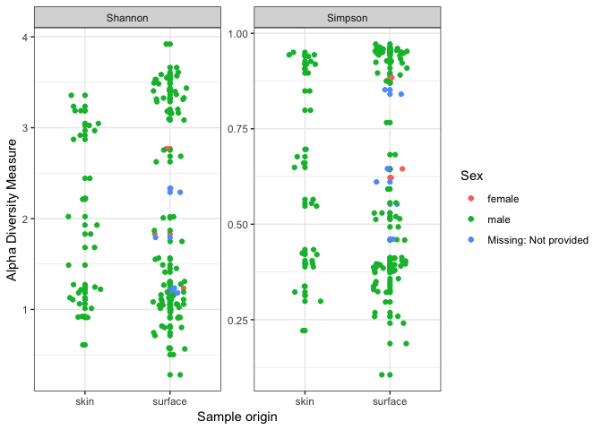

Analysis Report 1: Your Title Here
================
Brian Rezende
October 28, 2017

Introduction
============

Add about 1.5-2 pages here. Must cite at least 5 peer reviewed articles.

Methods
=======

Sample origin and sequencing
----------------------------

Add about half a page here. In this section instead of first person (I/we), use Fierer et al., since you'll just be describing what they did, based on the methods in their paper.

Computational
-------------

These are the methods you used. Should probably be at least a half of a page. At a very minimum should include citations for DADA2 (Callahan *et al.*, 2016) and phyloseq (McMurdie and Holmes, 2013). Note that these don't count towards the five references you need to cite in the introduction.

Results
=======

In addition to a minimum of 3-4 figures/tables (and associated captions), you should include sufficient text in this section to describe what your findings were. Remember that in the results section you just describe what you found, but you don't interpret it - that happens in the discussion.

``` r
# Be sure to install these packages before running this script
# They can be installed either with the intall.packages() function
# or with the 'Packages' pane in RStudio

# load general-use packages
library("dplyr")
library("tidyr")
library("knitr")
library("ggplot2")

# this package allows for the easy inclusion of literature citations in our Rmd
# more info here: https://github.com/crsh/citr
# and here:
# http://rmarkdown.rstudio.com/authoring_bibliographies_and_citations.html
library("citr")

# These are the primary packages well use to clean and analyze the data
# this package needs to be installed from bioconductor -- it's not on CRAN
# see info here: https://benjjneb.github.io/dada2/dada-installation.html
library("dada2")

# This to export a fasta of our final denoised sequence variants
library("seqinr")

# To install this you have to install from GitHub
# See more info here: https://github.com/leffj/mctoolsr
# run this -- install.packages("devtools")
# and then this -- devtools::install_github("leffj/mctoolsr")
library("mctoolsr")

# And this to visualize our results
# it also needs to be installed from bioconductor
library("phyloseq")
```

``` r
# NOTE: Much of the following follows the DADA2 tutorials available here:
# https://benjjneb.github.io/dada2/tutorial.html
# Accessed October 19, 2017

# set the base path for our input data files
path <- "data/raw_data"

# Sort ensures samples are in order
filenames_forward_reads <- sort(list.files(path, pattern = ".fastq"))

# Extract sample names, assuming filenames have format: SAMPLENAME.fastq
sample_names <- sapply(strsplit(filenames_forward_reads, "\\."), `[`, 1)

# Specify the full path to each of the filenames_forward_reads
filenames_forward_reads <- file.path(path, filenames_forward_reads)
```

``` r
# Plots the quality profiles of all twenty samples
plotQualityProfile(filenames_forward_reads[1:20])
```

    ## Scale for 'y' is already present. Adding another scale for 'y', which
    ## will replace the existing scale.


We can see from the quality profiles that most reads tend to get pretty bad in quality after around 200 bases.

``` r
# Place filtered files in filtered/ subdirectory
# note this will fail if the directory doesn't exist
filter_path <- file.path("output", "filtered")
filtered_reads_path <- file.path(filter_path,
                                 paste0(sample_names,
                                        "_filt.fastq.gz"))

# See ?filterAndTrim for details on the parameters
# See here for adjustments for 454 data:
# https://benjjneb.github.io/dada2/
#     faq.html#can-i-use-dada2-with-my-454-or-ion-torrent-data
filtered_output <- filterAndTrim(fwd = filenames_forward_reads,
                                 filt = filtered_reads_path,
                                 maxLen = 300,
                                 maxN = 0, # discard any seqs with Ns
                                 maxEE = 3, # allow w/ up to 3 expected errors
                                 truncQ = 2, # cut off if quality gets this low
                                 rm.phix = TRUE,
                                 compress = TRUE,
                                 multithread = FALSE)
```

``` r
# produce nicely-formatted markdown table of read counts
# before/after trimming
kable(filtered_output,
      col.names = c("Reads In",
                    "Reads Out"))
```

|                  |  Reads In|  Reads Out|
|------------------|---------:|----------:|
| ERR1938262.fastq |       320|        318|
| ERR1938263.fastq |       898|        895|
| ERR1938264.fastq |       665|        663|
| ERR1938265.fastq |       216|        216|
| ERR1938266.fastq |       327|        325|
| ERR1938267.fastq |       564|        563|
| ERR1938268.fastq |       577|        571|
| ERR1938269.fastq |      1270|       1267|
| ERR1938270.fastq |      1400|       1396|
| ERR1938271.fastq |      1210|       1204|
| ERR1938272.fastq |      1038|       1034|
| ERR1938273.fastq |      1083|       1079|
| ERR1938274.fastq |      1550|       1543|
| ERR1938275.fastq |      1245|       1239|
| ERR1938276.fastq |      1358|       1352|
| ERR1938277.fastq |      1165|       1162|
| ERR1938278.fastq |      1536|       1533|
| ERR1938279.fastq |      1109|       1102|
| ERR1938280.fastq |       960|        956|
| ERR1938281.fastq |      1126|       1124|
| ERR1938282.fastq |      1104|       1099|
| ERR1938283.fastq |      1359|       1355|
| ERR1938284.fastq |      1267|       1263|
| ERR1938285.fastq |      1275|       1261|
| ERR1938286.fastq |      1317|       1308|
| ERR1938287.fastq |      1109|       1106|
| ERR1938288.fastq |       475|        474|
| ERR1938289.fastq |      1241|       1240|
| ERR1938290.fastq |       971|        970|
| ERR1938291.fastq |      1223|       1215|
| ERR1938292.fastq |       691|        691|
| ERR1938293.fastq |       825|        820|
| ERR1938294.fastq |      1166|       1160|
| ERR1938295.fastq |      1063|       1059|
| ERR1938296.fastq |       620|        620|
| ERR1938297.fastq |      1221|       1215|
| ERR1938298.fastq |      1453|       1450|
| ERR1938299.fastq |      1221|       1219|
| ERR1938300.fastq |      1244|       1232|
| ERR1938301.fastq |       946|        943|
| ERR1938302.fastq |      1396|       1392|
| ERR1938303.fastq |      1068|       1065|
| ERR1938304.fastq |      1232|       1230|
| ERR1938305.fastq |      1053|       1049|
| ERR1938306.fastq |       502|        502|
| ERR1938307.fastq |      1386|       1384|
| ERR1938308.fastq |      1112|       1112|
| ERR1938309.fastq |       675|        674|
| ERR1938310.fastq |      1126|       1125|
| ERR1938311.fastq |      1026|       1023|
| ERR1938312.fastq |      1191|       1189|
| ERR1938313.fastq |      1282|       1273|
| ERR1938314.fastq |       811|        809|
| ERR1938315.fastq |      1101|       1098|
| ERR1938316.fastq |      1240|       1234|
| ERR1938317.fastq |       531|        529|
| ERR1938318.fastq |       241|        241|
| ERR1938319.fastq |      1335|       1328|
| ERR1938320.fastq |       728|        723|
| ERR1938321.fastq |      1957|       1947|
| ERR1938322.fastq |      1428|       1416|
| ERR1938323.fastq |      1134|       1127|
| ERR1938324.fastq |       757|        752|
| ERR1938325.fastq |      1329|       1320|
| ERR1938326.fastq |      1697|       1685|
| ERR1938327.fastq |       756|        753|
| ERR1938328.fastq |      1026|       1022|
| ERR1938329.fastq |      1249|       1245|
| ERR1938330.fastq |      1535|       1531|
| ERR1938331.fastq |      1166|       1160|
| ERR1938332.fastq |      1147|       1143|
| ERR1938333.fastq |      1212|       1211|
| ERR1938334.fastq |       836|        831|
| ERR1938335.fastq |      1497|       1489|
| ERR1938336.fastq |      1413|       1409|
| ERR1938337.fastq |      1080|       1075|
| ERR1938338.fastq |      1335|       1332|
| ERR1938339.fastq |      1130|       1127|
| ERR1938340.fastq |      1262|       1258|
| ERR1938341.fastq |       502|        499|
| ERR1938342.fastq |      1187|       1184|
| ERR1938343.fastq |      1020|       1017|
| ERR1938344.fastq |      1117|       1109|
| ERR1938345.fastq |      1290|       1285|
| ERR1938346.fastq |      1071|       1067|
| ERR1938347.fastq |      1052|       1049|
| ERR1938348.fastq |      1062|       1056|
| ERR1938349.fastq |      1496|       1493|
| ERR1938350.fastq |      1355|       1348|
| ERR1938351.fastq |       749|        742|
| ERR1938352.fastq |      2071|       2061|
| ERR1938353.fastq |       452|        452|
| ERR1938354.fastq |      1505|       1499|
| ERR1938355.fastq |      2288|       2281|
| ERR1938356.fastq |      1338|       1338|
| ERR1938357.fastq |      1092|       1090|
| ERR1938358.fastq |       903|        902|
| ERR1938359.fastq |      1595|       1584|
| ERR1938360.fastq |      1056|       1052|
| ERR1938361.fastq |      1280|       1277|
| ERR1938362.fastq |       610|        609|
| ERR1938363.fastq |      2026|       2013|
| ERR1938364.fastq |      1257|       1252|
| ERR1938365.fastq |       822|        819|
| ERR1938366.fastq |       277|        277|
| ERR1938367.fastq |      1082|       1077|
| ERR1938368.fastq |      1762|       1745|
| ERR1938369.fastq |      1536|       1528|
| ERR1938370.fastq |      1195|       1191|
| ERR1938371.fastq |       997|        996|
| ERR1938372.fastq |       842|        841|
| ERR1938373.fastq |       982|        982|
| ERR1938374.fastq |       464|        462|
| ERR1938375.fastq |       720|        718|
| ERR1938376.fastq |       584|        581|

``` r
# this build error models from each of the samples
errors_forward_reads <- learnErrors(filtered_reads_path,
                                    multithread = FALSE)
```

    ## Not all sequences were the same length.
    ## Not all sequences were the same length.
    ## Not all sequences were the same length.
    ## Not all sequences were the same length.
    ## Not all sequences were the same length.
    ## Not all sequences were the same length.
    ## Not all sequences were the same length.
    ## Not all sequences were the same length.
    ## Not all sequences were the same length.
    ## Not all sequences were the same length.
    ## Not all sequences were the same length.
    ## Not all sequences were the same length.
    ## Not all sequences were the same length.
    ## Not all sequences were the same length.
    ## Not all sequences were the same length.
    ## Not all sequences were the same length.
    ## Not all sequences were the same length.
    ## Not all sequences were the same length.
    ## Not all sequences were the same length.
    ## Not all sequences were the same length.
    ## Not all sequences were the same length.
    ## Not all sequences were the same length.
    ## Not all sequences were the same length.
    ## Not all sequences were the same length.
    ## Not all sequences were the same length.
    ## Not all sequences were the same length.
    ## Not all sequences were the same length.
    ## Not all sequences were the same length.
    ## Not all sequences were the same length.
    ## Not all sequences were the same length.
    ## Not all sequences were the same length.
    ## Not all sequences were the same length.
    ## Not all sequences were the same length.
    ## Not all sequences were the same length.
    ## Not all sequences were the same length.
    ## Not all sequences were the same length.
    ## Not all sequences were the same length.
    ## Not all sequences were the same length.
    ## Not all sequences were the same length.
    ## Not all sequences were the same length.
    ## Not all sequences were the same length.
    ## Not all sequences were the same length.
    ## Not all sequences were the same length.
    ## Not all sequences were the same length.
    ## Not all sequences were the same length.
    ## Not all sequences were the same length.
    ## Not all sequences were the same length.
    ## Not all sequences were the same length.
    ## Not all sequences were the same length.
    ## Not all sequences were the same length.
    ## Not all sequences were the same length.
    ## Not all sequences were the same length.
    ## Not all sequences were the same length.
    ## Not all sequences were the same length.
    ## Not all sequences were the same length.
    ## Not all sequences were the same length.
    ## Not all sequences were the same length.
    ## Not all sequences were the same length.
    ## Not all sequences were the same length.
    ## Not all sequences were the same length.
    ## Not all sequences were the same length.
    ## Not all sequences were the same length.
    ## Not all sequences were the same length.
    ## Not all sequences were the same length.
    ## Not all sequences were the same length.
    ## Not all sequences were the same length.
    ## Not all sequences were the same length.
    ## Not all sequences were the same length.
    ## Not all sequences were the same length.
    ## Not all sequences were the same length.
    ## Not all sequences were the same length.
    ## Not all sequences were the same length.
    ## Not all sequences were the same length.
    ## Not all sequences were the same length.
    ## Not all sequences were the same length.
    ## Not all sequences were the same length.
    ## Not all sequences were the same length.
    ## Not all sequences were the same length.
    ## Not all sequences were the same length.
    ## Not all sequences were the same length.
    ## Not all sequences were the same length.
    ## Not all sequences were the same length.
    ## Not all sequences were the same length.
    ## Not all sequences were the same length.
    ## Not all sequences were the same length.
    ## Not all sequences were the same length.
    ## Not all sequences were the same length.
    ## Not all sequences were the same length.
    ## Not all sequences were the same length.
    ## Not all sequences were the same length.
    ## Not all sequences were the same length.
    ## Not all sequences were the same length.
    ## Not all sequences were the same length.
    ## Not all sequences were the same length.
    ## Not all sequences were the same length.
    ## Not all sequences were the same length.
    ## Not all sequences were the same length.
    ## Not all sequences were the same length.
    ## Not all sequences were the same length.
    ## Not all sequences were the same length.
    ## Not all sequences were the same length.
    ## Not all sequences were the same length.
    ## Not all sequences were the same length.
    ## Not all sequences were the same length.
    ## Not all sequences were the same length.
    ## Not all sequences were the same length.
    ## Not all sequences were the same length.
    ## Not all sequences were the same length.
    ## Not all sequences were the same length.
    ## Not all sequences were the same length.
    ## Not all sequences were the same length.
    ## Not all sequences were the same length.
    ## Not all sequences were the same length.
    ## Not all sequences were the same length.
    ## Not all sequences were the same length.
    ## 28802208 total bases in 125531 reads from 115 samples will be used for learning the error rates.
    ## Initializing error rates to maximum possible estimate.
    ## selfConsist step 1 ...................................................................................................................
    ##    selfConsist step 2
    ##    selfConsist step 3
    ##    selfConsist step 4
    ##    selfConsist step 5
    ## Convergence after  5  rounds.

``` r
# quick check to see if error models match data
# (black lines match black points) and are generally decresing left to right
plotErrors(errors_forward_reads,
           nominalQ = TRUE)
```

    ## Warning: Transformation introduced infinite values in continuous y-axis

    ## Warning: Transformation introduced infinite values in continuous y-axis


``` r
# get rid of any duplicated sequences
dereplicated_forward_reads <- derepFastq(filtered_reads_path,
                                         verbose = TRUE)
```

    ## Dereplicating sequence entries in Fastq file: output/filtered/ERR1938262_filt.fastq.gz

    ## Encountered 139 unique sequences from 318 total sequences read.

    ## Not all sequences were the same length.

    ## Dereplicating sequence entries in Fastq file: output/filtered/ERR1938263_filt.fastq.gz

    ## Encountered 416 unique sequences from 895 total sequences read.

    ## Not all sequences were the same length.

    ## Dereplicating sequence entries in Fastq file: output/filtered/ERR1938264_filt.fastq.gz

    ## Encountered 317 unique sequences from 663 total sequences read.

    ## Not all sequences were the same length.

    ## Dereplicating sequence entries in Fastq file: output/filtered/ERR1938265_filt.fastq.gz

    ## Encountered 117 unique sequences from 216 total sequences read.

    ## Not all sequences were the same length.

    ## Dereplicating sequence entries in Fastq file: output/filtered/ERR1938266_filt.fastq.gz

    ## Encountered 135 unique sequences from 325 total sequences read.

    ## Not all sequences were the same length.

    ## Dereplicating sequence entries in Fastq file: output/filtered/ERR1938267_filt.fastq.gz

    ## Encountered 166 unique sequences from 563 total sequences read.

    ## Not all sequences were the same length.

    ## Dereplicating sequence entries in Fastq file: output/filtered/ERR1938268_filt.fastq.gz

    ## Encountered 212 unique sequences from 571 total sequences read.

    ## Not all sequences were the same length.

    ## Dereplicating sequence entries in Fastq file: output/filtered/ERR1938269_filt.fastq.gz

    ## Encountered 607 unique sequences from 1267 total sequences read.

    ## Not all sequences were the same length.

    ## Dereplicating sequence entries in Fastq file: output/filtered/ERR1938270_filt.fastq.gz

    ## Encountered 704 unique sequences from 1396 total sequences read.

    ## Not all sequences were the same length.

    ## Dereplicating sequence entries in Fastq file: output/filtered/ERR1938271_filt.fastq.gz

    ## Encountered 697 unique sequences from 1204 total sequences read.

    ## Not all sequences were the same length.

    ## Dereplicating sequence entries in Fastq file: output/filtered/ERR1938272_filt.fastq.gz

    ## Encountered 614 unique sequences from 1034 total sequences read.

    ## Not all sequences were the same length.

    ## Dereplicating sequence entries in Fastq file: output/filtered/ERR1938273_filt.fastq.gz

    ## Encountered 662 unique sequences from 1079 total sequences read.

    ## Not all sequences were the same length.

    ## Dereplicating sequence entries in Fastq file: output/filtered/ERR1938274_filt.fastq.gz

    ## Encountered 818 unique sequences from 1543 total sequences read.

    ## Not all sequences were the same length.

    ## Dereplicating sequence entries in Fastq file: output/filtered/ERR1938275_filt.fastq.gz

    ## Encountered 744 unique sequences from 1239 total sequences read.

    ## Not all sequences were the same length.

    ## Dereplicating sequence entries in Fastq file: output/filtered/ERR1938276_filt.fastq.gz

    ## Encountered 696 unique sequences from 1352 total sequences read.

    ## Not all sequences were the same length.

    ## Dereplicating sequence entries in Fastq file: output/filtered/ERR1938277_filt.fastq.gz

    ## Encountered 592 unique sequences from 1162 total sequences read.

    ## Not all sequences were the same length.

    ## Dereplicating sequence entries in Fastq file: output/filtered/ERR1938278_filt.fastq.gz

    ## Encountered 749 unique sequences from 1533 total sequences read.

    ## Not all sequences were the same length.

    ## Dereplicating sequence entries in Fastq file: output/filtered/ERR1938279_filt.fastq.gz

    ## Encountered 528 unique sequences from 1102 total sequences read.

    ## Not all sequences were the same length.

    ## Dereplicating sequence entries in Fastq file: output/filtered/ERR1938280_filt.fastq.gz

    ## Encountered 530 unique sequences from 956 total sequences read.

    ## Not all sequences were the same length.

    ## Dereplicating sequence entries in Fastq file: output/filtered/ERR1938281_filt.fastq.gz

    ## Encountered 580 unique sequences from 1124 total sequences read.

    ## Not all sequences were the same length.

    ## Dereplicating sequence entries in Fastq file: output/filtered/ERR1938282_filt.fastq.gz

    ## Encountered 523 unique sequences from 1099 total sequences read.

    ## Not all sequences were the same length.

    ## Dereplicating sequence entries in Fastq file: output/filtered/ERR1938283_filt.fastq.gz

    ## Encountered 638 unique sequences from 1355 total sequences read.

    ## Not all sequences were the same length.

    ## Dereplicating sequence entries in Fastq file: output/filtered/ERR1938284_filt.fastq.gz

    ## Encountered 600 unique sequences from 1263 total sequences read.

    ## Not all sequences were the same length.

    ## Dereplicating sequence entries in Fastq file: output/filtered/ERR1938285_filt.fastq.gz

    ## Encountered 536 unique sequences from 1261 total sequences read.

    ## Not all sequences were the same length.

    ## Dereplicating sequence entries in Fastq file: output/filtered/ERR1938286_filt.fastq.gz

    ## Encountered 659 unique sequences from 1308 total sequences read.

    ## Not all sequences were the same length.

    ## Dereplicating sequence entries in Fastq file: output/filtered/ERR1938287_filt.fastq.gz

    ## Encountered 492 unique sequences from 1106 total sequences read.

    ## Not all sequences were the same length.

    ## Dereplicating sequence entries in Fastq file: output/filtered/ERR1938288_filt.fastq.gz

    ## Encountered 251 unique sequences from 474 total sequences read.

    ## Not all sequences were the same length.

    ## Dereplicating sequence entries in Fastq file: output/filtered/ERR1938289_filt.fastq.gz

    ## Encountered 551 unique sequences from 1240 total sequences read.

    ## Not all sequences were the same length.

    ## Dereplicating sequence entries in Fastq file: output/filtered/ERR1938290_filt.fastq.gz

    ## Encountered 440 unique sequences from 970 total sequences read.

    ## Not all sequences were the same length.

    ## Dereplicating sequence entries in Fastq file: output/filtered/ERR1938291_filt.fastq.gz

    ## Encountered 579 unique sequences from 1215 total sequences read.

    ## Not all sequences were the same length.

    ## Dereplicating sequence entries in Fastq file: output/filtered/ERR1938292_filt.fastq.gz

    ## Encountered 401 unique sequences from 691 total sequences read.

    ## Not all sequences were the same length.

    ## Dereplicating sequence entries in Fastq file: output/filtered/ERR1938293_filt.fastq.gz

    ## Encountered 486 unique sequences from 820 total sequences read.

    ## Not all sequences were the same length.

    ## Dereplicating sequence entries in Fastq file: output/filtered/ERR1938294_filt.fastq.gz

    ## Encountered 419 unique sequences from 1160 total sequences read.

    ## Not all sequences were the same length.

    ## Dereplicating sequence entries in Fastq file: output/filtered/ERR1938295_filt.fastq.gz

    ## Encountered 505 unique sequences from 1059 total sequences read.

    ## Not all sequences were the same length.

    ## Dereplicating sequence entries in Fastq file: output/filtered/ERR1938296_filt.fastq.gz

    ## Encountered 331 unique sequences from 620 total sequences read.

    ## Not all sequences were the same length.

    ## Dereplicating sequence entries in Fastq file: output/filtered/ERR1938297_filt.fastq.gz

    ## Encountered 668 unique sequences from 1215 total sequences read.

    ## Not all sequences were the same length.

    ## Dereplicating sequence entries in Fastq file: output/filtered/ERR1938298_filt.fastq.gz

    ## Encountered 640 unique sequences from 1450 total sequences read.

    ## Not all sequences were the same length.

    ## Dereplicating sequence entries in Fastq file: output/filtered/ERR1938299_filt.fastq.gz

    ## Encountered 755 unique sequences from 1219 total sequences read.

    ## Not all sequences were the same length.

    ## Dereplicating sequence entries in Fastq file: output/filtered/ERR1938300_filt.fastq.gz

    ## Encountered 531 unique sequences from 1232 total sequences read.

    ## Not all sequences were the same length.

    ## Dereplicating sequence entries in Fastq file: output/filtered/ERR1938301_filt.fastq.gz

    ## Encountered 515 unique sequences from 943 total sequences read.

    ## Not all sequences were the same length.

    ## Dereplicating sequence entries in Fastq file: output/filtered/ERR1938302_filt.fastq.gz

    ## Encountered 590 unique sequences from 1392 total sequences read.

    ## Not all sequences were the same length.

    ## Dereplicating sequence entries in Fastq file: output/filtered/ERR1938303_filt.fastq.gz

    ## Encountered 504 unique sequences from 1065 total sequences read.

    ## Not all sequences were the same length.

    ## Dereplicating sequence entries in Fastq file: output/filtered/ERR1938304_filt.fastq.gz

    ## Encountered 633 unique sequences from 1230 total sequences read.

    ## Not all sequences were the same length.

    ## Dereplicating sequence entries in Fastq file: output/filtered/ERR1938305_filt.fastq.gz

    ## Encountered 554 unique sequences from 1049 total sequences read.

    ## Not all sequences were the same length.

    ## Dereplicating sequence entries in Fastq file: output/filtered/ERR1938306_filt.fastq.gz

    ## Encountered 296 unique sequences from 502 total sequences read.

    ## Not all sequences were the same length.

    ## Dereplicating sequence entries in Fastq file: output/filtered/ERR1938307_filt.fastq.gz

    ## Encountered 667 unique sequences from 1384 total sequences read.

    ## Not all sequences were the same length.

    ## Dereplicating sequence entries in Fastq file: output/filtered/ERR1938308_filt.fastq.gz

    ## Encountered 625 unique sequences from 1112 total sequences read.

    ## Not all sequences were the same length.

    ## Dereplicating sequence entries in Fastq file: output/filtered/ERR1938309_filt.fastq.gz

    ## Encountered 227 unique sequences from 674 total sequences read.

    ## Not all sequences were the same length.

    ## Dereplicating sequence entries in Fastq file: output/filtered/ERR1938310_filt.fastq.gz

    ## Encountered 291 unique sequences from 1125 total sequences read.

    ## Not all sequences were the same length.

    ## Dereplicating sequence entries in Fastq file: output/filtered/ERR1938311_filt.fastq.gz

    ## Encountered 238 unique sequences from 1023 total sequences read.

    ## Not all sequences were the same length.

    ## Dereplicating sequence entries in Fastq file: output/filtered/ERR1938312_filt.fastq.gz

    ## Encountered 309 unique sequences from 1189 total sequences read.

    ## Not all sequences were the same length.

    ## Dereplicating sequence entries in Fastq file: output/filtered/ERR1938313_filt.fastq.gz

    ## Encountered 385 unique sequences from 1273 total sequences read.

    ## Not all sequences were the same length.

    ## Dereplicating sequence entries in Fastq file: output/filtered/ERR1938314_filt.fastq.gz

    ## Encountered 237 unique sequences from 809 total sequences read.

    ## Not all sequences were the same length.

    ## Dereplicating sequence entries in Fastq file: output/filtered/ERR1938315_filt.fastq.gz

    ## Encountered 342 unique sequences from 1098 total sequences read.

    ## Not all sequences were the same length.

    ## Dereplicating sequence entries in Fastq file: output/filtered/ERR1938316_filt.fastq.gz

    ## Encountered 453 unique sequences from 1234 total sequences read.

    ## Not all sequences were the same length.

    ## Dereplicating sequence entries in Fastq file: output/filtered/ERR1938317_filt.fastq.gz

    ## Encountered 185 unique sequences from 529 total sequences read.

    ## Not all sequences were the same length.

    ## Dereplicating sequence entries in Fastq file: output/filtered/ERR1938318_filt.fastq.gz

    ## Encountered 88 unique sequences from 241 total sequences read.

    ## Not all sequences were the same length.

    ## Dereplicating sequence entries in Fastq file: output/filtered/ERR1938319_filt.fastq.gz

    ## Encountered 440 unique sequences from 1328 total sequences read.

    ## Not all sequences were the same length.

    ## Dereplicating sequence entries in Fastq file: output/filtered/ERR1938320_filt.fastq.gz

    ## Encountered 292 unique sequences from 723 total sequences read.

    ## Not all sequences were the same length.

    ## Dereplicating sequence entries in Fastq file: output/filtered/ERR1938321_filt.fastq.gz

    ## Encountered 543 unique sequences from 1947 total sequences read.

    ## Not all sequences were the same length.

    ## Dereplicating sequence entries in Fastq file: output/filtered/ERR1938322_filt.fastq.gz

    ## Encountered 527 unique sequences from 1416 total sequences read.

    ## Not all sequences were the same length.

    ## Dereplicating sequence entries in Fastq file: output/filtered/ERR1938323_filt.fastq.gz

    ## Encountered 363 unique sequences from 1127 total sequences read.

    ## Not all sequences were the same length.

    ## Dereplicating sequence entries in Fastq file: output/filtered/ERR1938324_filt.fastq.gz

    ## Encountered 225 unique sequences from 752 total sequences read.

    ## Not all sequences were the same length.

    ## Dereplicating sequence entries in Fastq file: output/filtered/ERR1938325_filt.fastq.gz

    ## Encountered 530 unique sequences from 1320 total sequences read.

    ## Not all sequences were the same length.

    ## Dereplicating sequence entries in Fastq file: output/filtered/ERR1938326_filt.fastq.gz

    ## Encountered 618 unique sequences from 1685 total sequences read.

    ## Not all sequences were the same length.

    ## Dereplicating sequence entries in Fastq file: output/filtered/ERR1938327_filt.fastq.gz

    ## Encountered 251 unique sequences from 753 total sequences read.

    ## Not all sequences were the same length.

    ## Dereplicating sequence entries in Fastq file: output/filtered/ERR1938328_filt.fastq.gz

    ## Encountered 362 unique sequences from 1022 total sequences read.

    ## Not all sequences were the same length.

    ## Dereplicating sequence entries in Fastq file: output/filtered/ERR1938329_filt.fastq.gz

    ## Encountered 277 unique sequences from 1245 total sequences read.

    ## Not all sequences were the same length.

    ## Dereplicating sequence entries in Fastq file: output/filtered/ERR1938330_filt.fastq.gz

    ## Encountered 598 unique sequences from 1531 total sequences read.

    ## Not all sequences were the same length.

    ## Dereplicating sequence entries in Fastq file: output/filtered/ERR1938331_filt.fastq.gz

    ## Encountered 426 unique sequences from 1160 total sequences read.

    ## Not all sequences were the same length.

    ## Dereplicating sequence entries in Fastq file: output/filtered/ERR1938332_filt.fastq.gz

    ## Encountered 395 unique sequences from 1143 total sequences read.

    ## Not all sequences were the same length.

    ## Dereplicating sequence entries in Fastq file: output/filtered/ERR1938333_filt.fastq.gz

    ## Encountered 369 unique sequences from 1211 total sequences read.

    ## Not all sequences were the same length.

    ## Dereplicating sequence entries in Fastq file: output/filtered/ERR1938334_filt.fastq.gz

    ## Encountered 249 unique sequences from 831 total sequences read.

    ## Not all sequences were the same length.

    ## Dereplicating sequence entries in Fastq file: output/filtered/ERR1938335_filt.fastq.gz

    ## Encountered 470 unique sequences from 1489 total sequences read.

    ## Not all sequences were the same length.

    ## Dereplicating sequence entries in Fastq file: output/filtered/ERR1938336_filt.fastq.gz

    ## Encountered 374 unique sequences from 1409 total sequences read.

    ## Not all sequences were the same length.

    ## Dereplicating sequence entries in Fastq file: output/filtered/ERR1938337_filt.fastq.gz

    ## Encountered 280 unique sequences from 1075 total sequences read.

    ## Not all sequences were the same length.

    ## Dereplicating sequence entries in Fastq file: output/filtered/ERR1938338_filt.fastq.gz

    ## Encountered 332 unique sequences from 1332 total sequences read.

    ## Not all sequences were the same length.

    ## Dereplicating sequence entries in Fastq file: output/filtered/ERR1938339_filt.fastq.gz

    ## Encountered 360 unique sequences from 1127 total sequences read.

    ## Not all sequences were the same length.

    ## Dereplicating sequence entries in Fastq file: output/filtered/ERR1938340_filt.fastq.gz

    ## Encountered 386 unique sequences from 1258 total sequences read.

    ## Not all sequences were the same length.

    ## Dereplicating sequence entries in Fastq file: output/filtered/ERR1938341_filt.fastq.gz

    ## Encountered 165 unique sequences from 499 total sequences read.

    ## Not all sequences were the same length.

    ## Dereplicating sequence entries in Fastq file: output/filtered/ERR1938342_filt.fastq.gz

    ## Encountered 256 unique sequences from 1184 total sequences read.

    ## Not all sequences were the same length.

    ## Dereplicating sequence entries in Fastq file: output/filtered/ERR1938343_filt.fastq.gz

    ## Encountered 310 unique sequences from 1017 total sequences read.

    ## Not all sequences were the same length.

    ## Dereplicating sequence entries in Fastq file: output/filtered/ERR1938344_filt.fastq.gz

    ## Encountered 273 unique sequences from 1109 total sequences read.

    ## Not all sequences were the same length.

    ## Dereplicating sequence entries in Fastq file: output/filtered/ERR1938345_filt.fastq.gz

    ## Encountered 317 unique sequences from 1285 total sequences read.

    ## Not all sequences were the same length.

    ## Dereplicating sequence entries in Fastq file: output/filtered/ERR1938346_filt.fastq.gz

    ## Encountered 294 unique sequences from 1067 total sequences read.

    ## Not all sequences were the same length.

    ## Dereplicating sequence entries in Fastq file: output/filtered/ERR1938347_filt.fastq.gz

    ## Encountered 348 unique sequences from 1049 total sequences read.

    ## Not all sequences were the same length.

    ## Dereplicating sequence entries in Fastq file: output/filtered/ERR1938348_filt.fastq.gz

    ## Encountered 289 unique sequences from 1056 total sequences read.

    ## Not all sequences were the same length.

    ## Dereplicating sequence entries in Fastq file: output/filtered/ERR1938349_filt.fastq.gz

    ## Encountered 358 unique sequences from 1493 total sequences read.

    ## Not all sequences were the same length.

    ## Dereplicating sequence entries in Fastq file: output/filtered/ERR1938350_filt.fastq.gz

    ## Encountered 336 unique sequences from 1348 total sequences read.

    ## Not all sequences were the same length.

    ## Dereplicating sequence entries in Fastq file: output/filtered/ERR1938351_filt.fastq.gz

    ## Encountered 238 unique sequences from 742 total sequences read.

    ## Not all sequences were the same length.

    ## Dereplicating sequence entries in Fastq file: output/filtered/ERR1938352_filt.fastq.gz

    ## Encountered 482 unique sequences from 2061 total sequences read.

    ## Not all sequences were the same length.

    ## Dereplicating sequence entries in Fastq file: output/filtered/ERR1938353_filt.fastq.gz

    ## Encountered 142 unique sequences from 452 total sequences read.

    ## Not all sequences were the same length.

    ## Dereplicating sequence entries in Fastq file: output/filtered/ERR1938354_filt.fastq.gz

    ## Encountered 397 unique sequences from 1499 total sequences read.

    ## Not all sequences were the same length.

    ## Dereplicating sequence entries in Fastq file: output/filtered/ERR1938355_filt.fastq.gz

    ## Encountered 524 unique sequences from 2281 total sequences read.

    ## Not all sequences were the same length.

    ## Dereplicating sequence entries in Fastq file: output/filtered/ERR1938356_filt.fastq.gz

    ## Encountered 389 unique sequences from 1338 total sequences read.

    ## Not all sequences were the same length.

    ## Dereplicating sequence entries in Fastq file: output/filtered/ERR1938357_filt.fastq.gz

    ## Encountered 277 unique sequences from 1090 total sequences read.

    ## Not all sequences were the same length.

    ## Dereplicating sequence entries in Fastq file: output/filtered/ERR1938358_filt.fastq.gz

    ## Encountered 239 unique sequences from 902 total sequences read.

    ## Not all sequences were the same length.

    ## Dereplicating sequence entries in Fastq file: output/filtered/ERR1938359_filt.fastq.gz

    ## Encountered 489 unique sequences from 1584 total sequences read.

    ## Not all sequences were the same length.

    ## Dereplicating sequence entries in Fastq file: output/filtered/ERR1938360_filt.fastq.gz

    ## Encountered 328 unique sequences from 1052 total sequences read.

    ## Not all sequences were the same length.

    ## Dereplicating sequence entries in Fastq file: output/filtered/ERR1938361_filt.fastq.gz

    ## Encountered 322 unique sequences from 1277 total sequences read.

    ## Not all sequences were the same length.

    ## Dereplicating sequence entries in Fastq file: output/filtered/ERR1938362_filt.fastq.gz

    ## Encountered 130 unique sequences from 609 total sequences read.

    ## Not all sequences were the same length.

    ## Dereplicating sequence entries in Fastq file: output/filtered/ERR1938363_filt.fastq.gz

    ## Encountered 509 unique sequences from 2013 total sequences read.

    ## Not all sequences were the same length.

    ## Dereplicating sequence entries in Fastq file: output/filtered/ERR1938364_filt.fastq.gz

    ## Encountered 353 unique sequences from 1252 total sequences read.

    ## Not all sequences were the same length.

    ## Dereplicating sequence entries in Fastq file: output/filtered/ERR1938365_filt.fastq.gz

    ## Encountered 187 unique sequences from 819 total sequences read.

    ## Not all sequences were the same length.

    ## Dereplicating sequence entries in Fastq file: output/filtered/ERR1938366_filt.fastq.gz

    ## Encountered 92 unique sequences from 277 total sequences read.

    ## Not all sequences were the same length.

    ## Dereplicating sequence entries in Fastq file: output/filtered/ERR1938367_filt.fastq.gz

    ## Encountered 327 unique sequences from 1077 total sequences read.

    ## Not all sequences were the same length.

    ## Dereplicating sequence entries in Fastq file: output/filtered/ERR1938368_filt.fastq.gz

    ## Encountered 577 unique sequences from 1745 total sequences read.

    ## Not all sequences were the same length.

    ## Dereplicating sequence entries in Fastq file: output/filtered/ERR1938369_filt.fastq.gz

    ## Encountered 378 unique sequences from 1528 total sequences read.

    ## Not all sequences were the same length.

    ## Dereplicating sequence entries in Fastq file: output/filtered/ERR1938370_filt.fastq.gz

    ## Encountered 260 unique sequences from 1191 total sequences read.

    ## Not all sequences were the same length.

    ## Dereplicating sequence entries in Fastq file: output/filtered/ERR1938371_filt.fastq.gz

    ## Encountered 277 unique sequences from 996 total sequences read.

    ## Not all sequences were the same length.

    ## Dereplicating sequence entries in Fastq file: output/filtered/ERR1938372_filt.fastq.gz

    ## Encountered 243 unique sequences from 841 total sequences read.

    ## Not all sequences were the same length.

    ## Dereplicating sequence entries in Fastq file: output/filtered/ERR1938373_filt.fastq.gz

    ## Encountered 377 unique sequences from 982 total sequences read.

    ## Not all sequences were the same length.

    ## Dereplicating sequence entries in Fastq file: output/filtered/ERR1938374_filt.fastq.gz

    ## Encountered 272 unique sequences from 462 total sequences read.

    ## Not all sequences were the same length.

    ## Dereplicating sequence entries in Fastq file: output/filtered/ERR1938375_filt.fastq.gz

    ## Encountered 267 unique sequences from 718 total sequences read.

    ## Not all sequences were the same length.

    ## Dereplicating sequence entries in Fastq file: output/filtered/ERR1938376_filt.fastq.gz

    ## Encountered 300 unique sequences from 581 total sequences read.

    ## Not all sequences were the same length.

``` r
# Name the derep-class objects by the sample names
names(dereplicated_forward_reads) <- sample_names
```

``` r
# parameters adjusted based on recommendations for 454 data here:
# https://benjjneb.github.io/dada2/
#     faq.html#can-i-use-dada2-with-my-454-or-ion-torrent-data
dada_forward_reads <- dada(dereplicated_forward_reads,
                           err = errors_forward_reads,
                           HOMOPOLYMER_GAP_PENALTY = -1, # reduce penalty bc 454
                           BAND_SIZE = 32) # performs local alignments bc indels
```

    ## Sample 1 - 318 reads in 139 unique sequences.
    ## Sample 2 - 895 reads in 416 unique sequences.
    ## Sample 3 - 663 reads in 317 unique sequences.
    ## Sample 4 - 216 reads in 117 unique sequences.
    ## Sample 5 - 325 reads in 135 unique sequences.
    ## Sample 6 - 563 reads in 166 unique sequences.
    ## Sample 7 - 571 reads in 212 unique sequences.
    ## Sample 8 - 1267 reads in 607 unique sequences.
    ## Sample 9 - 1396 reads in 704 unique sequences.
    ## Sample 10 - 1204 reads in 697 unique sequences.
    ## Sample 11 - 1034 reads in 614 unique sequences.
    ## Sample 12 - 1079 reads in 662 unique sequences.
    ## Sample 13 - 1543 reads in 818 unique sequences.
    ## Sample 14 - 1239 reads in 744 unique sequences.
    ## Sample 15 - 1352 reads in 696 unique sequences.
    ## Sample 16 - 1162 reads in 592 unique sequences.
    ## Sample 17 - 1533 reads in 749 unique sequences.
    ## Sample 18 - 1102 reads in 528 unique sequences.
    ## Sample 19 - 956 reads in 530 unique sequences.
    ## Sample 20 - 1124 reads in 580 unique sequences.
    ## Sample 21 - 1099 reads in 523 unique sequences.
    ## Sample 22 - 1355 reads in 638 unique sequences.
    ## Sample 23 - 1263 reads in 600 unique sequences.
    ## Sample 24 - 1261 reads in 536 unique sequences.
    ## Sample 25 - 1308 reads in 659 unique sequences.
    ## Sample 26 - 1106 reads in 492 unique sequences.
    ## Sample 27 - 474 reads in 251 unique sequences.
    ## Sample 28 - 1240 reads in 551 unique sequences.
    ## Sample 29 - 970 reads in 440 unique sequences.
    ## Sample 30 - 1215 reads in 579 unique sequences.
    ## Sample 31 - 691 reads in 401 unique sequences.
    ## Sample 32 - 820 reads in 486 unique sequences.
    ## Sample 33 - 1160 reads in 419 unique sequences.
    ## Sample 34 - 1059 reads in 505 unique sequences.
    ## Sample 35 - 620 reads in 331 unique sequences.
    ## Sample 36 - 1215 reads in 668 unique sequences.
    ## Sample 37 - 1450 reads in 640 unique sequences.
    ## Sample 38 - 1219 reads in 755 unique sequences.
    ## Sample 39 - 1232 reads in 531 unique sequences.
    ## Sample 40 - 943 reads in 515 unique sequences.
    ## Sample 41 - 1392 reads in 590 unique sequences.
    ## Sample 42 - 1065 reads in 504 unique sequences.
    ## Sample 43 - 1230 reads in 633 unique sequences.
    ## Sample 44 - 1049 reads in 554 unique sequences.
    ## Sample 45 - 502 reads in 296 unique sequences.
    ## Sample 46 - 1384 reads in 667 unique sequences.
    ## Sample 47 - 1112 reads in 625 unique sequences.
    ## Sample 48 - 674 reads in 227 unique sequences.
    ## Sample 49 - 1125 reads in 291 unique sequences.
    ## Sample 50 - 1023 reads in 238 unique sequences.
    ## Sample 51 - 1189 reads in 309 unique sequences.
    ## Sample 52 - 1273 reads in 385 unique sequences.
    ## Sample 53 - 809 reads in 237 unique sequences.
    ## Sample 54 - 1098 reads in 342 unique sequences.
    ## Sample 55 - 1234 reads in 453 unique sequences.
    ## Sample 56 - 529 reads in 185 unique sequences.
    ## Sample 57 - 241 reads in 88 unique sequences.
    ## Sample 58 - 1328 reads in 440 unique sequences.
    ## Sample 59 - 723 reads in 292 unique sequences.
    ## Sample 60 - 1947 reads in 543 unique sequences.
    ## Sample 61 - 1416 reads in 527 unique sequences.
    ## Sample 62 - 1127 reads in 363 unique sequences.
    ## Sample 63 - 752 reads in 225 unique sequences.
    ## Sample 64 - 1320 reads in 530 unique sequences.
    ## Sample 65 - 1685 reads in 618 unique sequences.
    ## Sample 66 - 753 reads in 251 unique sequences.
    ## Sample 67 - 1022 reads in 362 unique sequences.
    ## Sample 68 - 1245 reads in 277 unique sequences.
    ## Sample 69 - 1531 reads in 598 unique sequences.
    ## Sample 70 - 1160 reads in 426 unique sequences.
    ## Sample 71 - 1143 reads in 395 unique sequences.
    ## Sample 72 - 1211 reads in 369 unique sequences.
    ## Sample 73 - 831 reads in 249 unique sequences.
    ## Sample 74 - 1489 reads in 470 unique sequences.
    ## Sample 75 - 1409 reads in 374 unique sequences.
    ## Sample 76 - 1075 reads in 280 unique sequences.
    ## Sample 77 - 1332 reads in 332 unique sequences.
    ## Sample 78 - 1127 reads in 360 unique sequences.
    ## Sample 79 - 1258 reads in 386 unique sequences.
    ## Sample 80 - 499 reads in 165 unique sequences.
    ## Sample 81 - 1184 reads in 256 unique sequences.
    ## Sample 82 - 1017 reads in 310 unique sequences.
    ## Sample 83 - 1109 reads in 273 unique sequences.
    ## Sample 84 - 1285 reads in 317 unique sequences.
    ## Sample 85 - 1067 reads in 294 unique sequences.
    ## Sample 86 - 1049 reads in 348 unique sequences.
    ## Sample 87 - 1056 reads in 289 unique sequences.
    ## Sample 88 - 1493 reads in 358 unique sequences.
    ## Sample 89 - 1348 reads in 336 unique sequences.
    ## Sample 90 - 742 reads in 238 unique sequences.
    ## Sample 91 - 2061 reads in 482 unique sequences.
    ## Sample 92 - 452 reads in 142 unique sequences.
    ## Sample 93 - 1499 reads in 397 unique sequences.
    ## Sample 94 - 2281 reads in 524 unique sequences.
    ## Sample 95 - 1338 reads in 389 unique sequences.
    ## Sample 96 - 1090 reads in 277 unique sequences.
    ## Sample 97 - 902 reads in 239 unique sequences.
    ## Sample 98 - 1584 reads in 489 unique sequences.
    ## Sample 99 - 1052 reads in 328 unique sequences.
    ## Sample 100 - 1277 reads in 322 unique sequences.
    ## Sample 101 - 609 reads in 130 unique sequences.
    ## Sample 102 - 2013 reads in 509 unique sequences.
    ## Sample 103 - 1252 reads in 353 unique sequences.
    ## Sample 104 - 819 reads in 187 unique sequences.
    ## Sample 105 - 277 reads in 92 unique sequences.
    ## Sample 106 - 1077 reads in 327 unique sequences.
    ## Sample 107 - 1745 reads in 577 unique sequences.
    ## Sample 108 - 1528 reads in 378 unique sequences.
    ## Sample 109 - 1191 reads in 260 unique sequences.
    ## Sample 110 - 996 reads in 277 unique sequences.
    ## Sample 111 - 841 reads in 243 unique sequences.
    ## Sample 112 - 982 reads in 377 unique sequences.
    ## Sample 113 - 462 reads in 272 unique sequences.
    ## Sample 114 - 718 reads in 267 unique sequences.
    ## Sample 115 - 581 reads in 300 unique sequences.

``` r
# check dada results
dada_forward_reads
```

    ## $ERR1938262
    ## dada-class: object describing DADA2 denoising results
    ## 8 sequence variants were inferred from 139 input unique sequences.
    ## Key parameters: OMEGA_A = 1e-40, OMEGA_C = 1e-40, BAND_SIZE = 32
    ## 
    ## $ERR1938263
    ## dada-class: object describing DADA2 denoising results
    ## 31 sequence variants were inferred from 416 input unique sequences.
    ## Key parameters: OMEGA_A = 1e-40, OMEGA_C = 1e-40, BAND_SIZE = 32
    ## 
    ## $ERR1938264
    ## dada-class: object describing DADA2 denoising results
    ## 25 sequence variants were inferred from 317 input unique sequences.
    ## Key parameters: OMEGA_A = 1e-40, OMEGA_C = 1e-40, BAND_SIZE = 32
    ## 
    ## $ERR1938265
    ## dada-class: object describing DADA2 denoising results
    ## 8 sequence variants were inferred from 117 input unique sequences.
    ## Key parameters: OMEGA_A = 1e-40, OMEGA_C = 1e-40, BAND_SIZE = 32
    ## 
    ## $ERR1938266
    ## dada-class: object describing DADA2 denoising results
    ## 7 sequence variants were inferred from 135 input unique sequences.
    ## Key parameters: OMEGA_A = 1e-40, OMEGA_C = 1e-40, BAND_SIZE = 32
    ## 
    ## $ERR1938267
    ## dada-class: object describing DADA2 denoising results
    ## 7 sequence variants were inferred from 166 input unique sequences.
    ## Key parameters: OMEGA_A = 1e-40, OMEGA_C = 1e-40, BAND_SIZE = 32
    ## 
    ## $ERR1938268
    ## dada-class: object describing DADA2 denoising results
    ## 19 sequence variants were inferred from 212 input unique sequences.
    ## Key parameters: OMEGA_A = 1e-40, OMEGA_C = 1e-40, BAND_SIZE = 32
    ## 
    ## $ERR1938269
    ## dada-class: object describing DADA2 denoising results
    ## 61 sequence variants were inferred from 607 input unique sequences.
    ## Key parameters: OMEGA_A = 1e-40, OMEGA_C = 1e-40, BAND_SIZE = 32
    ## 
    ## $ERR1938270
    ## dada-class: object describing DADA2 denoising results
    ## 62 sequence variants were inferred from 704 input unique sequences.
    ## Key parameters: OMEGA_A = 1e-40, OMEGA_C = 1e-40, BAND_SIZE = 32
    ## 
    ## $ERR1938271
    ## dada-class: object describing DADA2 denoising results
    ## 49 sequence variants were inferred from 697 input unique sequences.
    ## Key parameters: OMEGA_A = 1e-40, OMEGA_C = 1e-40, BAND_SIZE = 32
    ## 
    ## $ERR1938272
    ## dada-class: object describing DADA2 denoising results
    ## 50 sequence variants were inferred from 614 input unique sequences.
    ## Key parameters: OMEGA_A = 1e-40, OMEGA_C = 1e-40, BAND_SIZE = 32
    ## 
    ## $ERR1938273
    ## dada-class: object describing DADA2 denoising results
    ## 46 sequence variants were inferred from 662 input unique sequences.
    ## Key parameters: OMEGA_A = 1e-40, OMEGA_C = 1e-40, BAND_SIZE = 32
    ## 
    ## $ERR1938274
    ## dada-class: object describing DADA2 denoising results
    ## 63 sequence variants were inferred from 818 input unique sequences.
    ## Key parameters: OMEGA_A = 1e-40, OMEGA_C = 1e-40, BAND_SIZE = 32
    ## 
    ## $ERR1938275
    ## dada-class: object describing DADA2 denoising results
    ## 49 sequence variants were inferred from 744 input unique sequences.
    ## Key parameters: OMEGA_A = 1e-40, OMEGA_C = 1e-40, BAND_SIZE = 32
    ## 
    ## $ERR1938276
    ## dada-class: object describing DADA2 denoising results
    ## 55 sequence variants were inferred from 696 input unique sequences.
    ## Key parameters: OMEGA_A = 1e-40, OMEGA_C = 1e-40, BAND_SIZE = 32
    ## 
    ## $ERR1938277
    ## dada-class: object describing DADA2 denoising results
    ## 52 sequence variants were inferred from 592 input unique sequences.
    ## Key parameters: OMEGA_A = 1e-40, OMEGA_C = 1e-40, BAND_SIZE = 32
    ## 
    ## $ERR1938278
    ## dada-class: object describing DADA2 denoising results
    ## 69 sequence variants were inferred from 749 input unique sequences.
    ## Key parameters: OMEGA_A = 1e-40, OMEGA_C = 1e-40, BAND_SIZE = 32
    ## 
    ## $ERR1938279
    ## dada-class: object describing DADA2 denoising results
    ## 41 sequence variants were inferred from 528 input unique sequences.
    ## Key parameters: OMEGA_A = 1e-40, OMEGA_C = 1e-40, BAND_SIZE = 32
    ## 
    ## $ERR1938280
    ## dada-class: object describing DADA2 denoising results
    ## 42 sequence variants were inferred from 530 input unique sequences.
    ## Key parameters: OMEGA_A = 1e-40, OMEGA_C = 1e-40, BAND_SIZE = 32
    ## 
    ## $ERR1938281
    ## dada-class: object describing DADA2 denoising results
    ## 51 sequence variants were inferred from 580 input unique sequences.
    ## Key parameters: OMEGA_A = 1e-40, OMEGA_C = 1e-40, BAND_SIZE = 32
    ## 
    ## $ERR1938282
    ## dada-class: object describing DADA2 denoising results
    ## 33 sequence variants were inferred from 523 input unique sequences.
    ## Key parameters: OMEGA_A = 1e-40, OMEGA_C = 1e-40, BAND_SIZE = 32
    ## 
    ## $ERR1938283
    ## dada-class: object describing DADA2 denoising results
    ## 59 sequence variants were inferred from 638 input unique sequences.
    ## Key parameters: OMEGA_A = 1e-40, OMEGA_C = 1e-40, BAND_SIZE = 32
    ## 
    ## $ERR1938284
    ## dada-class: object describing DADA2 denoising results
    ## 56 sequence variants were inferred from 600 input unique sequences.
    ## Key parameters: OMEGA_A = 1e-40, OMEGA_C = 1e-40, BAND_SIZE = 32
    ## 
    ## $ERR1938285
    ## dada-class: object describing DADA2 denoising results
    ## 40 sequence variants were inferred from 536 input unique sequences.
    ## Key parameters: OMEGA_A = 1e-40, OMEGA_C = 1e-40, BAND_SIZE = 32
    ## 
    ## $ERR1938286
    ## dada-class: object describing DADA2 denoising results
    ## 50 sequence variants were inferred from 659 input unique sequences.
    ## Key parameters: OMEGA_A = 1e-40, OMEGA_C = 1e-40, BAND_SIZE = 32
    ## 
    ## $ERR1938287
    ## dada-class: object describing DADA2 denoising results
    ## 40 sequence variants were inferred from 492 input unique sequences.
    ## Key parameters: OMEGA_A = 1e-40, OMEGA_C = 1e-40, BAND_SIZE = 32
    ## 
    ## $ERR1938288
    ## dada-class: object describing DADA2 denoising results
    ## 27 sequence variants were inferred from 251 input unique sequences.
    ## Key parameters: OMEGA_A = 1e-40, OMEGA_C = 1e-40, BAND_SIZE = 32
    ## 
    ## $ERR1938289
    ## dada-class: object describing DADA2 denoising results
    ## 57 sequence variants were inferred from 551 input unique sequences.
    ## Key parameters: OMEGA_A = 1e-40, OMEGA_C = 1e-40, BAND_SIZE = 32
    ## 
    ## $ERR1938290
    ## dada-class: object describing DADA2 denoising results
    ## 34 sequence variants were inferred from 440 input unique sequences.
    ## Key parameters: OMEGA_A = 1e-40, OMEGA_C = 1e-40, BAND_SIZE = 32
    ## 
    ## $ERR1938291
    ## dada-class: object describing DADA2 denoising results
    ## 43 sequence variants were inferred from 579 input unique sequences.
    ## Key parameters: OMEGA_A = 1e-40, OMEGA_C = 1e-40, BAND_SIZE = 32
    ## 
    ## $ERR1938292
    ## dada-class: object describing DADA2 denoising results
    ## 49 sequence variants were inferred from 401 input unique sequences.
    ## Key parameters: OMEGA_A = 1e-40, OMEGA_C = 1e-40, BAND_SIZE = 32
    ## 
    ## $ERR1938293
    ## dada-class: object describing DADA2 denoising results
    ## 47 sequence variants were inferred from 486 input unique sequences.
    ## Key parameters: OMEGA_A = 1e-40, OMEGA_C = 1e-40, BAND_SIZE = 32
    ## 
    ## $ERR1938294
    ## dada-class: object describing DADA2 denoising results
    ## 29 sequence variants were inferred from 419 input unique sequences.
    ## Key parameters: OMEGA_A = 1e-40, OMEGA_C = 1e-40, BAND_SIZE = 32
    ## 
    ## $ERR1938295
    ## dada-class: object describing DADA2 denoising results
    ## 39 sequence variants were inferred from 505 input unique sequences.
    ## Key parameters: OMEGA_A = 1e-40, OMEGA_C = 1e-40, BAND_SIZE = 32
    ## 
    ## $ERR1938296
    ## dada-class: object describing DADA2 denoising results
    ## 37 sequence variants were inferred from 331 input unique sequences.
    ## Key parameters: OMEGA_A = 1e-40, OMEGA_C = 1e-40, BAND_SIZE = 32
    ## 
    ## $ERR1938297
    ## dada-class: object describing DADA2 denoising results
    ## 48 sequence variants were inferred from 668 input unique sequences.
    ## Key parameters: OMEGA_A = 1e-40, OMEGA_C = 1e-40, BAND_SIZE = 32
    ## 
    ## $ERR1938298
    ## dada-class: object describing DADA2 denoising results
    ## 46 sequence variants were inferred from 640 input unique sequences.
    ## Key parameters: OMEGA_A = 1e-40, OMEGA_C = 1e-40, BAND_SIZE = 32
    ## 
    ## $ERR1938299
    ## dada-class: object describing DADA2 denoising results
    ## 59 sequence variants were inferred from 755 input unique sequences.
    ## Key parameters: OMEGA_A = 1e-40, OMEGA_C = 1e-40, BAND_SIZE = 32
    ## 
    ## $ERR1938300
    ## dada-class: object describing DADA2 denoising results
    ## 44 sequence variants were inferred from 531 input unique sequences.
    ## Key parameters: OMEGA_A = 1e-40, OMEGA_C = 1e-40, BAND_SIZE = 32
    ## 
    ## $ERR1938301
    ## dada-class: object describing DADA2 denoising results
    ## 36 sequence variants were inferred from 515 input unique sequences.
    ## Key parameters: OMEGA_A = 1e-40, OMEGA_C = 1e-40, BAND_SIZE = 32
    ## 
    ## $ERR1938302
    ## dada-class: object describing DADA2 denoising results
    ## 62 sequence variants were inferred from 590 input unique sequences.
    ## Key parameters: OMEGA_A = 1e-40, OMEGA_C = 1e-40, BAND_SIZE = 32
    ## 
    ## $ERR1938303
    ## dada-class: object describing DADA2 denoising results
    ## 51 sequence variants were inferred from 504 input unique sequences.
    ## Key parameters: OMEGA_A = 1e-40, OMEGA_C = 1e-40, BAND_SIZE = 32
    ## 
    ## $ERR1938304
    ## dada-class: object describing DADA2 denoising results
    ## 56 sequence variants were inferred from 633 input unique sequences.
    ## Key parameters: OMEGA_A = 1e-40, OMEGA_C = 1e-40, BAND_SIZE = 32
    ## 
    ## $ERR1938305
    ## dada-class: object describing DADA2 denoising results
    ## 45 sequence variants were inferred from 554 input unique sequences.
    ## Key parameters: OMEGA_A = 1e-40, OMEGA_C = 1e-40, BAND_SIZE = 32
    ## 
    ## $ERR1938306
    ## dada-class: object describing DADA2 denoising results
    ## 31 sequence variants were inferred from 296 input unique sequences.
    ## Key parameters: OMEGA_A = 1e-40, OMEGA_C = 1e-40, BAND_SIZE = 32
    ## 
    ## $ERR1938307
    ## dada-class: object describing DADA2 denoising results
    ## 62 sequence variants were inferred from 667 input unique sequences.
    ## Key parameters: OMEGA_A = 1e-40, OMEGA_C = 1e-40, BAND_SIZE = 32
    ## 
    ## $ERR1938308
    ## dada-class: object describing DADA2 denoising results
    ## 74 sequence variants were inferred from 625 input unique sequences.
    ## Key parameters: OMEGA_A = 1e-40, OMEGA_C = 1e-40, BAND_SIZE = 32
    ## 
    ## $ERR1938309
    ## dada-class: object describing DADA2 denoising results
    ## 17 sequence variants were inferred from 227 input unique sequences.
    ## Key parameters: OMEGA_A = 1e-40, OMEGA_C = 1e-40, BAND_SIZE = 32
    ## 
    ## $ERR1938310
    ## dada-class: object describing DADA2 denoising results
    ## 24 sequence variants were inferred from 291 input unique sequences.
    ## Key parameters: OMEGA_A = 1e-40, OMEGA_C = 1e-40, BAND_SIZE = 32
    ## 
    ## $ERR1938311
    ## dada-class: object describing DADA2 denoising results
    ## 17 sequence variants were inferred from 238 input unique sequences.
    ## Key parameters: OMEGA_A = 1e-40, OMEGA_C = 1e-40, BAND_SIZE = 32
    ## 
    ## $ERR1938312
    ## dada-class: object describing DADA2 denoising results
    ## 18 sequence variants were inferred from 309 input unique sequences.
    ## Key parameters: OMEGA_A = 1e-40, OMEGA_C = 1e-40, BAND_SIZE = 32
    ## 
    ## $ERR1938313
    ## dada-class: object describing DADA2 denoising results
    ## 21 sequence variants were inferred from 385 input unique sequences.
    ## Key parameters: OMEGA_A = 1e-40, OMEGA_C = 1e-40, BAND_SIZE = 32
    ## 
    ## $ERR1938314
    ## dada-class: object describing DADA2 denoising results
    ## 17 sequence variants were inferred from 237 input unique sequences.
    ## Key parameters: OMEGA_A = 1e-40, OMEGA_C = 1e-40, BAND_SIZE = 32
    ## 
    ## $ERR1938315
    ## dada-class: object describing DADA2 denoising results
    ## 24 sequence variants were inferred from 342 input unique sequences.
    ## Key parameters: OMEGA_A = 1e-40, OMEGA_C = 1e-40, BAND_SIZE = 32
    ## 
    ## $ERR1938316
    ## dada-class: object describing DADA2 denoising results
    ## 28 sequence variants were inferred from 453 input unique sequences.
    ## Key parameters: OMEGA_A = 1e-40, OMEGA_C = 1e-40, BAND_SIZE = 32
    ## 
    ## $ERR1938317
    ## dada-class: object describing DADA2 denoising results
    ## 18 sequence variants were inferred from 185 input unique sequences.
    ## Key parameters: OMEGA_A = 1e-40, OMEGA_C = 1e-40, BAND_SIZE = 32
    ## 
    ## $ERR1938318
    ## dada-class: object describing DADA2 denoising results
    ## 10 sequence variants were inferred from 88 input unique sequences.
    ## Key parameters: OMEGA_A = 1e-40, OMEGA_C = 1e-40, BAND_SIZE = 32
    ## 
    ## $ERR1938319
    ## dada-class: object describing DADA2 denoising results
    ## 35 sequence variants were inferred from 440 input unique sequences.
    ## Key parameters: OMEGA_A = 1e-40, OMEGA_C = 1e-40, BAND_SIZE = 32
    ## 
    ## $ERR1938320
    ## dada-class: object describing DADA2 denoising results
    ## 32 sequence variants were inferred from 292 input unique sequences.
    ## Key parameters: OMEGA_A = 1e-40, OMEGA_C = 1e-40, BAND_SIZE = 32
    ## 
    ## $ERR1938321
    ## dada-class: object describing DADA2 denoising results
    ## 32 sequence variants were inferred from 543 input unique sequences.
    ## Key parameters: OMEGA_A = 1e-40, OMEGA_C = 1e-40, BAND_SIZE = 32
    ## 
    ## $ERR1938322
    ## dada-class: object describing DADA2 denoising results
    ## 40 sequence variants were inferred from 527 input unique sequences.
    ## Key parameters: OMEGA_A = 1e-40, OMEGA_C = 1e-40, BAND_SIZE = 32
    ## 
    ## $ERR1938323
    ## dada-class: object describing DADA2 denoising results
    ## 31 sequence variants were inferred from 363 input unique sequences.
    ## Key parameters: OMEGA_A = 1e-40, OMEGA_C = 1e-40, BAND_SIZE = 32
    ## 
    ## $ERR1938324
    ## dada-class: object describing DADA2 denoising results
    ## 18 sequence variants were inferred from 225 input unique sequences.
    ## Key parameters: OMEGA_A = 1e-40, OMEGA_C = 1e-40, BAND_SIZE = 32
    ## 
    ## $ERR1938325
    ## dada-class: object describing DADA2 denoising results
    ## 47 sequence variants were inferred from 530 input unique sequences.
    ## Key parameters: OMEGA_A = 1e-40, OMEGA_C = 1e-40, BAND_SIZE = 32
    ## 
    ## $ERR1938326
    ## dada-class: object describing DADA2 denoising results
    ## 36 sequence variants were inferred from 618 input unique sequences.
    ## Key parameters: OMEGA_A = 1e-40, OMEGA_C = 1e-40, BAND_SIZE = 32
    ## 
    ## $ERR1938327
    ## dada-class: object describing DADA2 denoising results
    ## 16 sequence variants were inferred from 251 input unique sequences.
    ## Key parameters: OMEGA_A = 1e-40, OMEGA_C = 1e-40, BAND_SIZE = 32
    ## 
    ## $ERR1938328
    ## dada-class: object describing DADA2 denoising results
    ## 25 sequence variants were inferred from 362 input unique sequences.
    ## Key parameters: OMEGA_A = 1e-40, OMEGA_C = 1e-40, BAND_SIZE = 32
    ## 
    ## $ERR1938329
    ## dada-class: object describing DADA2 denoising results
    ## 13 sequence variants were inferred from 277 input unique sequences.
    ## Key parameters: OMEGA_A = 1e-40, OMEGA_C = 1e-40, BAND_SIZE = 32
    ## 
    ## $ERR1938330
    ## dada-class: object describing DADA2 denoising results
    ## 39 sequence variants were inferred from 598 input unique sequences.
    ## Key parameters: OMEGA_A = 1e-40, OMEGA_C = 1e-40, BAND_SIZE = 32
    ## 
    ## $ERR1938331
    ## dada-class: object describing DADA2 denoising results
    ## 33 sequence variants were inferred from 426 input unique sequences.
    ## Key parameters: OMEGA_A = 1e-40, OMEGA_C = 1e-40, BAND_SIZE = 32
    ## 
    ## $ERR1938332
    ## dada-class: object describing DADA2 denoising results
    ## 29 sequence variants were inferred from 395 input unique sequences.
    ## Key parameters: OMEGA_A = 1e-40, OMEGA_C = 1e-40, BAND_SIZE = 32
    ## 
    ## $ERR1938333
    ## dada-class: object describing DADA2 denoising results
    ## 27 sequence variants were inferred from 369 input unique sequences.
    ## Key parameters: OMEGA_A = 1e-40, OMEGA_C = 1e-40, BAND_SIZE = 32
    ## 
    ## $ERR1938334
    ## dada-class: object describing DADA2 denoising results
    ## 17 sequence variants were inferred from 249 input unique sequences.
    ## Key parameters: OMEGA_A = 1e-40, OMEGA_C = 1e-40, BAND_SIZE = 32
    ## 
    ## $ERR1938335
    ## dada-class: object describing DADA2 denoising results
    ## 27 sequence variants were inferred from 470 input unique sequences.
    ## Key parameters: OMEGA_A = 1e-40, OMEGA_C = 1e-40, BAND_SIZE = 32
    ## 
    ## $ERR1938336
    ## dada-class: object describing DADA2 denoising results
    ## 31 sequence variants were inferred from 374 input unique sequences.
    ## Key parameters: OMEGA_A = 1e-40, OMEGA_C = 1e-40, BAND_SIZE = 32
    ## 
    ## $ERR1938337
    ## dada-class: object describing DADA2 denoising results
    ## 17 sequence variants were inferred from 280 input unique sequences.
    ## Key parameters: OMEGA_A = 1e-40, OMEGA_C = 1e-40, BAND_SIZE = 32
    ## 
    ## $ERR1938338
    ## dada-class: object describing DADA2 denoising results
    ## 26 sequence variants were inferred from 332 input unique sequences.
    ## Key parameters: OMEGA_A = 1e-40, OMEGA_C = 1e-40, BAND_SIZE = 32
    ## 
    ## $ERR1938339
    ## dada-class: object describing DADA2 denoising results
    ## 20 sequence variants were inferred from 360 input unique sequences.
    ## Key parameters: OMEGA_A = 1e-40, OMEGA_C = 1e-40, BAND_SIZE = 32
    ## 
    ## $ERR1938340
    ## dada-class: object describing DADA2 denoising results
    ## 22 sequence variants were inferred from 386 input unique sequences.
    ## Key parameters: OMEGA_A = 1e-40, OMEGA_C = 1e-40, BAND_SIZE = 32
    ## 
    ## $ERR1938341
    ## dada-class: object describing DADA2 denoising results
    ## 9 sequence variants were inferred from 165 input unique sequences.
    ## Key parameters: OMEGA_A = 1e-40, OMEGA_C = 1e-40, BAND_SIZE = 32
    ## 
    ## $ERR1938342
    ## dada-class: object describing DADA2 denoising results
    ## 26 sequence variants were inferred from 256 input unique sequences.
    ## Key parameters: OMEGA_A = 1e-40, OMEGA_C = 1e-40, BAND_SIZE = 32
    ## 
    ## $ERR1938343
    ## dada-class: object describing DADA2 denoising results
    ## 16 sequence variants were inferred from 310 input unique sequences.
    ## Key parameters: OMEGA_A = 1e-40, OMEGA_C = 1e-40, BAND_SIZE = 32
    ## 
    ## $ERR1938344
    ## dada-class: object describing DADA2 denoising results
    ## 16 sequence variants were inferred from 273 input unique sequences.
    ## Key parameters: OMEGA_A = 1e-40, OMEGA_C = 1e-40, BAND_SIZE = 32
    ## 
    ## $ERR1938345
    ## dada-class: object describing DADA2 denoising results
    ## 28 sequence variants were inferred from 317 input unique sequences.
    ## Key parameters: OMEGA_A = 1e-40, OMEGA_C = 1e-40, BAND_SIZE = 32
    ## 
    ## $ERR1938346
    ## dada-class: object describing DADA2 denoising results
    ## 15 sequence variants were inferred from 294 input unique sequences.
    ## Key parameters: OMEGA_A = 1e-40, OMEGA_C = 1e-40, BAND_SIZE = 32
    ## 
    ## $ERR1938347
    ## dada-class: object describing DADA2 denoising results
    ## 18 sequence variants were inferred from 348 input unique sequences.
    ## Key parameters: OMEGA_A = 1e-40, OMEGA_C = 1e-40, BAND_SIZE = 32
    ## 
    ## $ERR1938348
    ## dada-class: object describing DADA2 denoising results
    ## 20 sequence variants were inferred from 289 input unique sequences.
    ## Key parameters: OMEGA_A = 1e-40, OMEGA_C = 1e-40, BAND_SIZE = 32
    ## 
    ## $ERR1938349
    ## dada-class: object describing DADA2 denoising results
    ## 24 sequence variants were inferred from 358 input unique sequences.
    ## Key parameters: OMEGA_A = 1e-40, OMEGA_C = 1e-40, BAND_SIZE = 32
    ## 
    ## $ERR1938350
    ## dada-class: object describing DADA2 denoising results
    ## 21 sequence variants were inferred from 336 input unique sequences.
    ## Key parameters: OMEGA_A = 1e-40, OMEGA_C = 1e-40, BAND_SIZE = 32
    ## 
    ## $ERR1938351
    ## dada-class: object describing DADA2 denoising results
    ## 9 sequence variants were inferred from 238 input unique sequences.
    ## Key parameters: OMEGA_A = 1e-40, OMEGA_C = 1e-40, BAND_SIZE = 32
    ## 
    ## $ERR1938352
    ## dada-class: object describing DADA2 denoising results
    ## 22 sequence variants were inferred from 482 input unique sequences.
    ## Key parameters: OMEGA_A = 1e-40, OMEGA_C = 1e-40, BAND_SIZE = 32
    ## 
    ## $ERR1938353
    ## dada-class: object describing DADA2 denoising results
    ## 9 sequence variants were inferred from 142 input unique sequences.
    ## Key parameters: OMEGA_A = 1e-40, OMEGA_C = 1e-40, BAND_SIZE = 32
    ## 
    ## $ERR1938354
    ## dada-class: object describing DADA2 denoising results
    ## 27 sequence variants were inferred from 397 input unique sequences.
    ## Key parameters: OMEGA_A = 1e-40, OMEGA_C = 1e-40, BAND_SIZE = 32
    ## 
    ## $ERR1938355
    ## dada-class: object describing DADA2 denoising results
    ## 27 sequence variants were inferred from 524 input unique sequences.
    ## Key parameters: OMEGA_A = 1e-40, OMEGA_C = 1e-40, BAND_SIZE = 32
    ## 
    ## $ERR1938356
    ## dada-class: object describing DADA2 denoising results
    ## 24 sequence variants were inferred from 389 input unique sequences.
    ## Key parameters: OMEGA_A = 1e-40, OMEGA_C = 1e-40, BAND_SIZE = 32
    ## 
    ## $ERR1938357
    ## dada-class: object describing DADA2 denoising results
    ## 15 sequence variants were inferred from 277 input unique sequences.
    ## Key parameters: OMEGA_A = 1e-40, OMEGA_C = 1e-40, BAND_SIZE = 32
    ## 
    ## $ERR1938358
    ## dada-class: object describing DADA2 denoising results
    ## 23 sequence variants were inferred from 239 input unique sequences.
    ## Key parameters: OMEGA_A = 1e-40, OMEGA_C = 1e-40, BAND_SIZE = 32
    ## 
    ## $ERR1938359
    ## dada-class: object describing DADA2 denoising results
    ## 27 sequence variants were inferred from 489 input unique sequences.
    ## Key parameters: OMEGA_A = 1e-40, OMEGA_C = 1e-40, BAND_SIZE = 32
    ## 
    ## $ERR1938360
    ## dada-class: object describing DADA2 denoising results
    ## 19 sequence variants were inferred from 328 input unique sequences.
    ## Key parameters: OMEGA_A = 1e-40, OMEGA_C = 1e-40, BAND_SIZE = 32
    ## 
    ## $ERR1938361
    ## dada-class: object describing DADA2 denoising results
    ## 27 sequence variants were inferred from 322 input unique sequences.
    ## Key parameters: OMEGA_A = 1e-40, OMEGA_C = 1e-40, BAND_SIZE = 32
    ## 
    ## $ERR1938362
    ## dada-class: object describing DADA2 denoising results
    ## 5 sequence variants were inferred from 130 input unique sequences.
    ## Key parameters: OMEGA_A = 1e-40, OMEGA_C = 1e-40, BAND_SIZE = 32
    ## 
    ## $ERR1938363
    ## dada-class: object describing DADA2 denoising results
    ## 36 sequence variants were inferred from 509 input unique sequences.
    ## Key parameters: OMEGA_A = 1e-40, OMEGA_C = 1e-40, BAND_SIZE = 32
    ## 
    ## $ERR1938364
    ## dada-class: object describing DADA2 denoising results
    ## 26 sequence variants were inferred from 353 input unique sequences.
    ## Key parameters: OMEGA_A = 1e-40, OMEGA_C = 1e-40, BAND_SIZE = 32
    ## 
    ## $ERR1938365
    ## dada-class: object describing DADA2 denoising results
    ## 18 sequence variants were inferred from 187 input unique sequences.
    ## Key parameters: OMEGA_A = 1e-40, OMEGA_C = 1e-40, BAND_SIZE = 32
    ## 
    ## $ERR1938366
    ## dada-class: object describing DADA2 denoising results
    ## 4 sequence variants were inferred from 92 input unique sequences.
    ## Key parameters: OMEGA_A = 1e-40, OMEGA_C = 1e-40, BAND_SIZE = 32
    ## 
    ## $ERR1938367
    ## dada-class: object describing DADA2 denoising results
    ## 16 sequence variants were inferred from 327 input unique sequences.
    ## Key parameters: OMEGA_A = 1e-40, OMEGA_C = 1e-40, BAND_SIZE = 32
    ## 
    ## $ERR1938368
    ## dada-class: object describing DADA2 denoising results
    ## 34 sequence variants were inferred from 577 input unique sequences.
    ## Key parameters: OMEGA_A = 1e-40, OMEGA_C = 1e-40, BAND_SIZE = 32
    ## 
    ## $ERR1938369
    ## dada-class: object describing DADA2 denoising results
    ## 24 sequence variants were inferred from 378 input unique sequences.
    ## Key parameters: OMEGA_A = 1e-40, OMEGA_C = 1e-40, BAND_SIZE = 32
    ## 
    ## $ERR1938370
    ## dada-class: object describing DADA2 denoising results
    ## 9 sequence variants were inferred from 260 input unique sequences.
    ## Key parameters: OMEGA_A = 1e-40, OMEGA_C = 1e-40, BAND_SIZE = 32
    ## 
    ## $ERR1938371
    ## dada-class: object describing DADA2 denoising results
    ## 16 sequence variants were inferred from 277 input unique sequences.
    ## Key parameters: OMEGA_A = 1e-40, OMEGA_C = 1e-40, BAND_SIZE = 32
    ## 
    ## $ERR1938372
    ## dada-class: object describing DADA2 denoising results
    ## 15 sequence variants were inferred from 243 input unique sequences.
    ## Key parameters: OMEGA_A = 1e-40, OMEGA_C = 1e-40, BAND_SIZE = 32
    ## 
    ## $ERR1938373
    ## dada-class: object describing DADA2 denoising results
    ## 34 sequence variants were inferred from 377 input unique sequences.
    ## Key parameters: OMEGA_A = 1e-40, OMEGA_C = 1e-40, BAND_SIZE = 32
    ## 
    ## $ERR1938374
    ## dada-class: object describing DADA2 denoising results
    ## 22 sequence variants were inferred from 272 input unique sequences.
    ## Key parameters: OMEGA_A = 1e-40, OMEGA_C = 1e-40, BAND_SIZE = 32
    ## 
    ## $ERR1938375
    ## dada-class: object describing DADA2 denoising results
    ## 15 sequence variants were inferred from 267 input unique sequences.
    ## Key parameters: OMEGA_A = 1e-40, OMEGA_C = 1e-40, BAND_SIZE = 32
    ## 
    ## $ERR1938376
    ## dada-class: object describing DADA2 denoising results
    ## 23 sequence variants were inferred from 300 input unique sequences.
    ## Key parameters: OMEGA_A = 1e-40, OMEGA_C = 1e-40, BAND_SIZE = 32

``` r
# produce the 'site by species matrix'
sequence_table <- makeSequenceTable(dada_forward_reads)
```

    ## The sequences being tabled vary in length.

The output table has 115 rows (samples) and 1539 columns (sequence variants). Notice how we can embed R code directly in our markdown text.

``` r
# Quick check to look at distribution of trimmed and denoised sequences
hist(nchar(getSequences(sequence_table)),
     main = "Histogram of final sequence variant lengths",
     xlab = "Sequence length in bp")
```


``` r
# Check for and remove chimeras
sequence_table_nochim <- removeBimeraDenovo(sequence_table,
                                            method = "consensus",
                                            multithread = FALSE,
                                            verbose = TRUE)
```

    ## Identified 6 bimeras out of 1539 input sequences.

``` r
# What percent of our reads are non-chimeric?
non_chimeric_reads <- round(sum(sequence_table_nochim) / sum(sequence_table),
                            digits = 4) * 100
```

After removing chimeras, we were left with 99.97% of our cleaned reads.

``` r
# Build a table showing how many sequences remain at each step of the pipeline
get_n <- function(x) sum(getUniques(x)) # make a quick function
track <- cbind(filtered_output, # already has 2 columns
               sapply(dada_forward_reads, get_n),
               rowSums(sequence_table),
               rowSums(sequence_table_nochim))

# add nice meaningful column names
colnames(track) <- c("Input",
                     "Filtered",
                     "Denoised",
                     "Sequence Table",
                     "Non-chimeric")

# set the proper rownames
rownames(track) <- sample_names

# produce nice markdown table of progress through the pipeline
kable(track)
```

|            |  Input|  Filtered|  Denoised|  Sequence Table|  Non-chimeric|
|------------|------:|---------:|---------:|---------------:|-------------:|
| ERR1938262 |    320|       318|       271|             271|           271|
| ERR1938263 |    898|       895|       788|             788|           788|
| ERR1938264 |    665|       663|       578|             578|           578|
| ERR1938265 |    216|       216|       161|             161|           161|
| ERR1938266 |    327|       325|       277|             277|           277|
| ERR1938267 |    564|       563|       538|             538|           538|
| ERR1938268 |    577|       571|       533|             533|           533|
| ERR1938269 |   1270|      1267|      1186|            1186|          1186|
| ERR1938270 |   1400|      1396|      1301|            1301|          1301|
| ERR1938271 |   1210|      1204|      1071|            1071|          1071|
| ERR1938272 |   1038|      1034|       940|             940|           940|
| ERR1938273 |   1083|      1079|       972|             972|           972|
| ERR1938274 |   1550|      1543|      1438|            1438|          1438|
| ERR1938275 |   1245|      1239|      1078|            1078|          1078|
| ERR1938276 |   1358|      1352|      1225|            1225|          1225|
| ERR1938277 |   1165|      1162|      1072|            1072|          1072|
| ERR1938278 |   1536|      1533|      1398|            1398|          1398|
| ERR1938279 |   1109|      1102|      1036|            1036|          1036|
| ERR1938280 |    960|       956|       886|             886|           886|
| ERR1938281 |   1126|      1124|      1012|            1012|          1012|
| ERR1938282 |   1104|      1099|       973|             973|           973|
| ERR1938283 |   1359|      1355|      1238|            1238|          1238|
| ERR1938284 |   1267|      1263|      1157|            1157|          1157|
| ERR1938285 |   1275|      1261|      1193|            1193|          1193|
| ERR1938286 |   1317|      1308|      1181|            1181|          1177|
| ERR1938287 |   1109|      1106|      1018|            1018|          1014|
| ERR1938288 |    475|       474|       402|             402|           402|
| ERR1938289 |   1241|      1240|      1141|            1141|          1141|
| ERR1938290 |    971|       970|       895|             895|           895|
| ERR1938291 |   1223|      1215|      1087|            1087|          1087|
| ERR1938292 |    691|       691|       600|             600|           600|
| ERR1938293 |    825|       820|       708|             708|           708|
| ERR1938294 |   1166|      1160|      1089|            1089|          1079|
| ERR1938295 |   1063|      1059|       955|             955|           955|
| ERR1938296 |    620|       620|       538|             538|           538|
| ERR1938297 |   1221|      1215|      1097|            1097|          1089|
| ERR1938298 |   1453|      1450|      1358|            1358|          1358|
| ERR1938299 |   1221|      1219|      1078|            1078|          1078|
| ERR1938300 |   1244|      1232|      1120|            1120|          1117|
| ERR1938301 |    946|       943|       843|             843|           843|
| ERR1938302 |   1396|      1392|      1313|            1313|          1313|
| ERR1938303 |   1068|      1065|       978|             978|           978|
| ERR1938304 |   1232|      1230|      1137|            1137|          1137|
| ERR1938305 |   1053|      1049|       924|             924|           924|
| ERR1938306 |    502|       502|       418|             418|           418|
| ERR1938307 |   1386|      1384|      1267|            1267|          1267|
| ERR1938308 |   1112|      1112|      1009|            1009|          1009|
| ERR1938309 |    675|       674|       610|             610|           610|
| ERR1938310 |   1126|      1125|      1077|            1077|          1077|
| ERR1938311 |   1026|      1023|       986|             986|           986|
| ERR1938312 |   1191|      1189|      1110|            1110|          1110|
| ERR1938313 |   1282|      1273|      1206|            1206|          1206|
| ERR1938314 |    811|       809|       759|             759|           759|
| ERR1938315 |   1101|      1098|      1041|            1041|          1041|
| ERR1938316 |   1240|      1234|      1118|            1118|          1118|
| ERR1938317 |    531|       529|       479|             479|           479|
| ERR1938318 |    241|       241|       208|             208|           208|
| ERR1938319 |   1335|      1328|      1230|            1230|          1230|
| ERR1938320 |    728|       723|       634|             634|           634|
| ERR1938321 |   1957|      1947|      1860|            1860|          1860|
| ERR1938322 |   1428|      1416|      1289|            1289|          1286|
| ERR1938323 |   1134|      1127|      1066|            1066|          1066|
| ERR1938324 |    757|       752|       704|             704|           704|
| ERR1938325 |   1329|      1320|      1208|            1208|          1208|
| ERR1938326 |   1697|      1685|      1540|            1540|          1540|
| ERR1938327 |    756|       753|       664|             664|           664|
| ERR1938328 |   1026|      1022|       954|             954|           954|
| ERR1938329 |   1249|      1245|      1185|            1185|          1185|
| ERR1938330 |   1535|      1531|      1375|            1375|          1375|
| ERR1938331 |   1166|      1160|      1086|            1086|          1086|
| ERR1938332 |   1147|      1143|      1039|            1039|          1039|
| ERR1938333 |   1212|      1211|      1137|            1137|          1137|
| ERR1938334 |    836|       831|       789|             789|           789|
| ERR1938335 |   1497|      1489|      1410|            1410|          1410|
| ERR1938336 |   1413|      1409|      1354|            1354|          1354|
| ERR1938337 |   1080|      1075|      1029|            1029|          1029|
| ERR1938338 |   1335|      1332|      1257|            1257|          1257|
| ERR1938339 |   1130|      1127|      1021|            1021|          1021|
| ERR1938340 |   1262|      1258|      1183|            1183|          1183|
| ERR1938341 |    502|       499|       444|             444|           444|
| ERR1938342 |   1187|      1184|      1140|            1140|          1140|
| ERR1938343 |   1020|      1017|       978|             978|           978|
| ERR1938344 |   1117|      1109|      1071|            1071|          1071|
| ERR1938345 |   1290|      1285|      1256|            1256|          1256|
| ERR1938346 |   1071|      1067|      1008|            1008|          1008|
| ERR1938347 |   1052|      1049|       996|             996|           996|
| ERR1938348 |   1062|      1056|      1021|            1021|          1021|
| ERR1938349 |   1496|      1493|      1452|            1452|          1452|
| ERR1938350 |   1355|      1348|      1315|            1315|          1315|
| ERR1938351 |    749|       742|       694|             694|           694|
| ERR1938352 |   2071|      2061|      2021|            2021|          2021|
| ERR1938353 |    452|       452|       421|             421|           421|
| ERR1938354 |   1505|      1499|      1453|            1453|          1453|
| ERR1938355 |   2288|      2281|      2232|            2232|          2232|
| ERR1938356 |   1338|      1338|      1295|            1295|          1295|
| ERR1938357 |   1092|      1090|      1057|            1057|          1057|
| ERR1938358 |    903|       902|       867|             867|           867|
| ERR1938359 |   1595|      1584|      1493|            1493|          1493|
| ERR1938360 |   1056|      1052|       994|             994|           994|
| ERR1938361 |   1280|      1277|      1245|            1245|          1245|
| ERR1938362 |    610|       609|       565|             565|           565|
| ERR1938363 |   2026|      2013|      1945|            1945|          1945|
| ERR1938364 |   1257|      1252|      1205|            1205|          1205|
| ERR1938365 |    822|       819|       789|             789|           789|
| ERR1938366 |    277|       277|       245|             245|           245|
| ERR1938367 |   1082|      1077|      1019|            1019|          1019|
| ERR1938368 |   1762|      1745|      1677|            1677|          1677|
| ERR1938369 |   1536|      1528|      1468|            1468|          1468|
| ERR1938370 |   1195|      1191|      1163|            1163|          1163|
| ERR1938371 |    997|       996|       960|             960|           960|
| ERR1938372 |    842|       841|       802|             802|           802|
| ERR1938373 |    982|       982|       894|             894|           894|
| ERR1938374 |    464|       462|       370|             370|           370|
| ERR1938375 |    720|       718|       637|             637|           637|
| ERR1938376 |    584|       581|       491|             491|           491|

``` r
# assigns taxonomy to each sequence variant based on a supplied training set
# made up of known sequences
taxa <- assignTaxonomy(sequence_table_nochim,
                       "data/training/rdp_train_set_16.fa.gz",
                       multithread = TRUE,
                       tryRC = TRUE) # also check with seq reverse compliments

# show the results of the taxonomy assignment
unname(taxa)
```

    ##         [,1]       [,2]                          [,3]                   
    ##    [1,] "Bacteria" "Actinobacteria"              "Actinobacteria"       
    ##    [2,] "Bacteria" "Actinobacteria"              "Actinobacteria"       
    ##    [3,] "Bacteria" "Firmicutes"                  "Bacilli"              
    ##    [4,] "Bacteria" "Firmicutes"                  "Bacilli"              
    ##    [5,] "Bacteria" "Actinobacteria"              "Actinobacteria"       
    ##    [6,] "Bacteria" "Cyanobacteria/Chloroplast"   "Chloroplast"          
    ##    [7,] "Bacteria" "Firmicutes"                  "Bacilli"              
    ##    [8,] "Bacteria" "Firmicutes"                  "Clostridia"           
    ##    [9,] "Bacteria" "Cyanobacteria/Chloroplast"   "Chloroplast"          
    ##   [10,] "Bacteria" "Firmicutes"                  "Bacilli"              
    ##   [11,] "Bacteria" "Firmicutes"                  "Clostridia"           
    ##   [12,] "Bacteria" "Firmicutes"                  "Bacilli"              
    ##   [13,] "Bacteria" "Actinobacteria"              "Actinobacteria"       
    ##   [14,] "Bacteria" "Firmicutes"                  "Bacilli"              
    ##   [15,] "Bacteria" "Actinobacteria"              "Actinobacteria"       
    ##   [16,] "Bacteria" "Actinobacteria"              "Actinobacteria"       
    ##   [17,] "Bacteria" "Firmicutes"                  "Bacilli"              
    ##   [18,] "Bacteria" "Firmicutes"                  "Bacilli"              
    ##   [19,] "Bacteria" "Firmicutes"                  "Bacilli"              
    ##   [20,] "Bacteria" "Firmicutes"                  "Bacilli"              
    ##   [21,] "Bacteria" "Actinobacteria"              "Actinobacteria"       
    ##   [22,] "Bacteria" "Firmicutes"                  "Bacilli"              
    ##   [23,] "Bacteria" "Proteobacteria"              "Gammaproteobacteria"  
    ##   [24,] "Bacteria" "Firmicutes"                  "Negativicutes"        
    ##   [25,] "Bacteria" "Actinobacteria"              "Actinobacteria"       
    ##   [26,] "Bacteria" "Cyanobacteria/Chloroplast"   "Chloroplast"          
    ##   [27,] "Bacteria" "Firmicutes"                  "Bacilli"              
    ##   [28,] "Bacteria" "Firmicutes"                  "Bacilli"              
    ##   [29,] "Bacteria" "Firmicutes"                  "Clostridia"           
    ##   [30,] "Bacteria" "Cyanobacteria/Chloroplast"   "Chloroplast"          
    ##   [31,] "Bacteria" "Cyanobacteria/Chloroplast"   "Chloroplast"          
    ##   [32,] "Bacteria" "Actinobacteria"              "Actinobacteria"       
    ##   [33,] "Bacteria" "Firmicutes"                  "Bacilli"              
    ##   [34,] "Bacteria" "Firmicutes"                  "Clostridia"           
    ##   [35,] "Bacteria" "Actinobacteria"              "Actinobacteria"       
    ##   [36,] "Bacteria" "Bacteroidetes"               "Bacteroidia"          
    ##   [37,] "Bacteria" "Actinobacteria"              "Actinobacteria"       
    ##   [38,] "Bacteria" "Firmicutes"                  "Clostridia"           
    ##   [39,] "Bacteria" "Actinobacteria"              "Actinobacteria"       
    ##   [40,] "Bacteria" "Firmicutes"                  "Bacilli"              
    ##   [41,] "Bacteria" "Proteobacteria"              "Gammaproteobacteria"  
    ##   [42,] "Bacteria" "Firmicutes"                  "Bacilli"              
    ##   [43,] "Bacteria" "Firmicutes"                  "Bacilli"              
    ##   [44,] "Bacteria" "Actinobacteria"              "Actinobacteria"       
    ##   [45,] "Bacteria" "Firmicutes"                  "Clostridia"           
    ##   [46,] "Bacteria" "Firmicutes"                  "Bacilli"              
    ##   [47,] "Bacteria" "Firmicutes"                  "Clostridia"           
    ##   [48,] "Bacteria" "Firmicutes"                  "Bacilli"              
    ##   [49,] "Bacteria" "Firmicutes"                  "Bacilli"              
    ##   [50,] "Bacteria" "Firmicutes"                  "Clostridia"           
    ##   [51,] "Bacteria" "Firmicutes"                  "Bacilli"              
    ##   [52,] "Bacteria" "Actinobacteria"              "Actinobacteria"       
    ##   [53,] "Bacteria" "Firmicutes"                  "Bacilli"              
    ##   [54,] "Bacteria" "Firmicutes"                  "Bacilli"              
    ##   [55,] "Bacteria" "Firmicutes"                  "Clostridia"           
    ##   [56,] "Bacteria" "Actinobacteria"              "Actinobacteria"       
    ##   [57,] "Bacteria" "Actinobacteria"              "Actinobacteria"       
    ##   [58,] "Bacteria" "Cyanobacteria/Chloroplast"   "Chloroplast"          
    ##   [59,] "Bacteria" "Actinobacteria"              "Actinobacteria"       
    ##   [60,] "Bacteria" "Firmicutes"                  "Clostridia"           
    ##   [61,] "Bacteria" "Proteobacteria"              "Betaproteobacteria"   
    ##   [62,] "Bacteria" "Cyanobacteria/Chloroplast"   "Chloroplast"          
    ##   [63,] "Bacteria" "Firmicutes"                  "Bacilli"              
    ##   [64,] "Bacteria" "Actinobacteria"              "Actinobacteria"       
    ##   [65,] "Bacteria" "Actinobacteria"              "Actinobacteria"       
    ##   [66,] "Bacteria" "Proteobacteria"              "Betaproteobacteria"   
    ##   [67,] "Bacteria" "Firmicutes"                  "Bacilli"              
    ##   [68,] "Bacteria" "Actinobacteria"              "Actinobacteria"       
    ##   [69,] "Bacteria" "Actinobacteria"              "Actinobacteria"       
    ##   [70,] "Bacteria" "Actinobacteria"              "Actinobacteria"       
    ##   [71,] "Bacteria" "Actinobacteria"              "Actinobacteria"       
    ##   [72,] "Bacteria" "Firmicutes"                  "Bacilli"              
    ##   [73,] "Bacteria" "Actinobacteria"              "Actinobacteria"       
    ##   [74,] "Bacteria" "Firmicutes"                  "Bacilli"              
    ##   [75,] "Bacteria" "Firmicutes"                  "Negativicutes"        
    ##   [76,] "Bacteria" "Bacteroidetes"               "Bacteroidia"          
    ##   [77,] "Bacteria" "Firmicutes"                  "Clostridia"           
    ##   [78,] "Bacteria" "Proteobacteria"              "Gammaproteobacteria"  
    ##   [79,] "Bacteria" "Actinobacteria"              "Actinobacteria"       
    ##   [80,] "Bacteria" "Proteobacteria"              "Gammaproteobacteria"  
    ##   [81,] "Bacteria" "Firmicutes"                  "Clostridia"           
    ##   [82,] "Bacteria" "Firmicutes"                  "Clostridia"           
    ##   [83,] "Bacteria" "Proteobacteria"              "Betaproteobacteria"   
    ##   [84,] "Bacteria" "Cyanobacteria/Chloroplast"   "Chloroplast"          
    ##   [85,] "Bacteria" "Firmicutes"                  "Bacilli"              
    ##   [86,] "Bacteria" "Actinobacteria"              "Actinobacteria"       
    ##   [87,] "Bacteria" "Firmicutes"                  "Clostridia"           
    ##   [88,] "Bacteria" "Actinobacteria"              "Actinobacteria"       
    ##   [89,] "Bacteria" "Firmicutes"                  "Bacilli"              
    ##   [90,] "Bacteria" "Firmicutes"                  "Bacilli"              
    ##   [91,] "Bacteria" "Firmicutes"                  "Bacilli"              
    ##   [92,] "Bacteria" "Proteobacteria"              "Gammaproteobacteria"  
    ##   [93,] "Bacteria" "Actinobacteria"              "Actinobacteria"       
    ##   [94,] "Bacteria" "Firmicutes"                  "Clostridia"           
    ##   [95,] "Bacteria" "Proteobacteria"              "Gammaproteobacteria"  
    ##   [96,] "Bacteria" "Bacteroidetes"               "Bacteroidia"          
    ##   [97,] "Bacteria" "Firmicutes"                  "Clostridia"           
    ##   [98,] "Bacteria" "Firmicutes"                  "Clostridia"           
    ##   [99,] "Bacteria" "Actinobacteria"              "Actinobacteria"       
    ##  [100,] "Bacteria" "Firmicutes"                  "Bacilli"              
    ##  [101,] "Bacteria" "Firmicutes"                  "Clostridia"           
    ##  [102,] "Bacteria" "Cyanobacteria/Chloroplast"   "Chloroplast"          
    ##  [103,] "Bacteria" "Bacteroidetes"               "Bacteroidia"          
    ##  [104,] "Bacteria" "Firmicutes"                  "Bacilli"              
    ##  [105,] "Bacteria" "Actinobacteria"              "Actinobacteria"       
    ##  [106,] "Bacteria" "Firmicutes"                  "Clostridia"           
    ##  [107,] "Bacteria" "Firmicutes"                  "Bacilli"              
    ##  [108,] "Bacteria" "Actinobacteria"              "Actinobacteria"       
    ##  [109,] "Bacteria" "Firmicutes"                  "Bacilli"              
    ##  [110,] "Bacteria" "Actinobacteria"              "Actinobacteria"       
    ##  [111,] "Bacteria" "Actinobacteria"              "Actinobacteria"       
    ##  [112,] "Bacteria" "Firmicutes"                  "Bacilli"              
    ##  [113,] "Bacteria" "Firmicutes"                  "Clostridia"           
    ##  [114,] "Bacteria" "Proteobacteria"              "Betaproteobacteria"   
    ##  [115,] "Bacteria" "Firmicutes"                  "Bacilli"              
    ##  [116,] "Bacteria" "Actinobacteria"              "Actinobacteria"       
    ##  [117,] "Bacteria" "Proteobacteria"              "Betaproteobacteria"   
    ##  [118,] "Bacteria" "Actinobacteria"              "Actinobacteria"       
    ##  [119,] "Bacteria" "Firmicutes"                  "Bacilli"              
    ##  [120,] "Bacteria" "Cyanobacteria/Chloroplast"   "Chloroplast"          
    ##  [121,] "Bacteria" "Cyanobacteria/Chloroplast"   "Chloroplast"          
    ##  [122,] "Bacteria" "Firmicutes"                  "Clostridia"           
    ##  [123,] "Bacteria" "Firmicutes"                  "Clostridia"           
    ##  [124,] "Bacteria" "Proteobacteria"              "Gammaproteobacteria"  
    ##  [125,] "Bacteria" "Cyanobacteria/Chloroplast"   "Chloroplast"          
    ##  [126,] "Bacteria" "Firmicutes"                  "Erysipelotrichia"     
    ##  [127,] "Bacteria" "Firmicutes"                  "Bacilli"              
    ##  [128,] "Bacteria" "Firmicutes"                  "Bacilli"              
    ##  [129,] "Bacteria" "Proteobacteria"              "Betaproteobacteria"   
    ##  [130,] "Bacteria" "Proteobacteria"              "Gammaproteobacteria"  
    ##  [131,] "Bacteria" "Bacteroidetes"               "Bacteroidia"          
    ##  [132,] "Bacteria" "Firmicutes"                  "Bacilli"              
    ##  [133,] "Bacteria" "Actinobacteria"              "Actinobacteria"       
    ##  [134,] "Bacteria" "Firmicutes"                  "Clostridia"           
    ##  [135,] "Bacteria" "Cyanobacteria/Chloroplast"   "Chloroplast"          
    ##  [136,] "Bacteria" "Firmicutes"                  "Bacilli"              
    ##  [137,] "Bacteria" "Firmicutes"                  "Bacilli"              
    ##  [138,] "Bacteria" "Actinobacteria"              "Actinobacteria"       
    ##  [139,] "Bacteria" "Firmicutes"                  "Bacilli"              
    ##  [140,] "Bacteria" "Proteobacteria"              "Betaproteobacteria"   
    ##  [141,] "Bacteria" "Actinobacteria"              "Actinobacteria"       
    ##  [142,] "Bacteria" "Firmicutes"                  "Bacilli"              
    ##  [143,] "Bacteria" "Firmicutes"                  "Clostridia"           
    ##  [144,] "Bacteria" "Firmicutes"                  "Negativicutes"        
    ##  [145,] "Bacteria" "Firmicutes"                  "Clostridia"           
    ##  [146,] "Bacteria" "Firmicutes"                  "Negativicutes"        
    ##  [147,] "Bacteria" "Cyanobacteria/Chloroplast"   "Chloroplast"          
    ##  [148,] "Bacteria" "Proteobacteria"              "Gammaproteobacteria"  
    ##  [149,] "Bacteria" "Firmicutes"                  "Clostridia"           
    ##  [150,] "Bacteria" "Firmicutes"                  "Bacilli"              
    ##  [151,] "Bacteria" "Firmicutes"                  "Clostridia"           
    ##  [152,] "Bacteria" "Firmicutes"                  "Bacilli"              
    ##  [153,] "Bacteria" "Actinobacteria"              "Actinobacteria"       
    ##  [154,] "Bacteria" "Firmicutes"                  "Bacilli"              
    ##  [155,] "Bacteria" "Firmicutes"                  "Clostridia"           
    ##  [156,] "Bacteria" "Firmicutes"                  "Clostridia"           
    ##  [157,] "Bacteria" "Actinobacteria"              "Actinobacteria"       
    ##  [158,] "Bacteria" "Firmicutes"                  "Clostridia"           
    ##  [159,] "Bacteria" "Firmicutes"                  "Negativicutes"        
    ##  [160,] "Bacteria" "Firmicutes"                  "Bacilli"              
    ##  [161,] "Bacteria" "Firmicutes"                  "Bacilli"              
    ##  [162,] "Bacteria" "Firmicutes"                  "Clostridia"           
    ##  [163,] "Bacteria" "Proteobacteria"              "Betaproteobacteria"   
    ##  [164,] "Bacteria" "Cyanobacteria/Chloroplast"   "Chloroplast"          
    ##  [165,] "Bacteria" "Firmicutes"                  "Bacilli"              
    ##  [166,] "Bacteria" "Firmicutes"                  "Clostridia"           
    ##         [,4]                  [,5]                               
    ##    [1,] "Actinomycetales"     "Propionibacteriaceae"             
    ##    [2,] "Actinomycetales"     "Corynebacteriaceae"               
    ##    [3,] "Bacillales"          "Staphylococcaceae"                
    ##    [4,] "Lactobacillales"     "Streptococcaceae"                 
    ##    [5,] "Actinomycetales"     "Corynebacteriaceae"               
    ##    [6,] "Chloroplast"         "Streptophyta"                     
    ##    [7,] "Bacillales"          "Staphylococcaceae"                
    ##    [8,] "Clostridiales"       "Clostridiales_Incertae_Sedis_XI"  
    ##    [9,] "Chloroplast"         "Streptophyta"                     
    ##   [10,] "Bacillales"          "Staphylococcaceae"                
    ##   [11,] "Clostridiales"       "Lachnospiraceae"                  
    ##   [12,] "Lactobacillales"     "Streptococcaceae"                 
    ##   [13,] "Actinomycetales"     "Corynebacteriaceae"               
    ##   [14,] "Lactobacillales"     "Streptococcaceae"                 
    ##   [15,] "Actinomycetales"     "Corynebacteriaceae"               
    ##   [16,] "Actinomycetales"     NA                                 
    ##   [17,] "Bacillales"          "Staphylococcaceae"                
    ##   [18,] "Lactobacillales"     "Streptococcaceae"                 
    ##   [19,] "Lactobacillales"     "Streptococcaceae"                 
    ##   [20,] "Lactobacillales"     "Streptococcaceae"                 
    ##   [21,] "Actinomycetales"     "Micrococcaceae"                   
    ##   [22,] "Bacillales"          "Staphylococcaceae"                
    ##   [23,] "Pasteurellales"      "Pasteurellaceae"                  
    ##   [24,] "Selenomonadales"     "Veillonellaceae"                  
    ##   [25,] "Actinomycetales"     "Corynebacteriaceae"               
    ##   [26,] "Chloroplast"         "Streptophyta"                     
    ##   [27,] "Lactobacillales"     "Streptococcaceae"                 
    ##   [28,] "Lactobacillales"     "Streptococcaceae"                 
    ##   [29,] "Clostridiales"       "Lachnospiraceae"                  
    ##   [30,] "Chloroplast"         "Streptophyta"                     
    ##   [31,] "Chloroplast"         "Streptophyta"                     
    ##   [32,] "Actinomycetales"     "Corynebacteriaceae"               
    ##   [33,] "Bacillales"          "Staphylococcaceae"                
    ##   [34,] "Clostridiales"       "Clostridiales_Incertae_Sedis_XI"  
    ##   [35,] "Actinomycetales"     "Propionibacteriaceae"             
    ##   [36,] "Bacteroidales"       "Prevotellaceae"                   
    ##   [37,] "Actinomycetales"     "Corynebacteriaceae"               
    ##   [38,] "Clostridiales"       "Clostridiales_Incertae_Sedis_XI"  
    ##   [39,] "Actinomycetales"     "Micrococcaceae"                   
    ##   [40,] "Bacillales"          "Staphylococcaceae"                
    ##   [41,] "Pasteurellales"      "Pasteurellaceae"                  
    ##   [42,] "Lactobacillales"     "Streptococcaceae"                 
    ##   [43,] "Lactobacillales"     "Streptococcaceae"                 
    ##   [44,] "Coriobacteriales"    "Coriobacteriaceae"                
    ##   [45,] "Clostridiales"       "Clostridiales_Incertae_Sedis_XI"  
    ##   [46,] "Lactobacillales"     "Streptococcaceae"                 
    ##   [47,] "Clostridiales"       "Clostridiales_Incertae_Sedis_XI"  
    ##   [48,] "Lactobacillales"     "Streptococcaceae"                 
    ##   [49,] "Bacillales"          "Staphylococcaceae"                
    ##   [50,] "Clostridiales"       "Ruminococcaceae"                  
    ##   [51,] "Lactobacillales"     "Streptococcaceae"                 
    ##   [52,] "Actinomycetales"     NA                                 
    ##   [53,] "Lactobacillales"     "Streptococcaceae"                 
    ##   [54,] "Lactobacillales"     "Streptococcaceae"                 
    ##   [55,] "Clostridiales"       "Clostridiales_Incertae_Sedis_XI"  
    ##   [56,] "Actinomycetales"     "Actinomycetaceae"                 
    ##   [57,] "Actinomycetales"     "Corynebacteriaceae"               
    ##   [58,] "Chloroplast"         "Streptophyta"                     
    ##   [59,] "Actinomycetales"     "Corynebacteriaceae"               
    ##   [60,] "Clostridiales"       "Lachnospiraceae"                  
    ##   [61,] "Neisseriales"        "Neisseriaceae"                    
    ##   [62,] "Chloroplast"         "Streptophyta"                     
    ##   [63,] "Bacillales"          "Staphylococcaceae"                
    ##   [64,] "Actinomycetales"     "Corynebacteriaceae"               
    ##   [65,] "Actinomycetales"     "Propionibacteriaceae"             
    ##   [66,] "Neisseriales"        "Neisseriaceae"                    
    ##   [67,] "Lactobacillales"     "Streptococcaceae"                 
    ##   [68,] "Actinomycetales"     "Actinomycetaceae"                 
    ##   [69,] "Actinomycetales"     "Micrococcaceae"                   
    ##   [70,] "Actinomycetales"     "Actinomycetaceae"                 
    ##   [71,] "Actinomycetales"     "Propionibacteriaceae"             
    ##   [72,] "Bacillales"          "Staphylococcaceae"                
    ##   [73,] "Actinomycetales"     "Actinomycetaceae"                 
    ##   [74,] "Bacillales"          "Alicyclobacillaceae"              
    ##   [75,] "Selenomonadales"     "Veillonellaceae"                  
    ##   [76,] "Bacteroidales"       "Bacteroidaceae"                   
    ##   [77,] "Clostridiales"       "Peptoniphilaceae"                 
    ##   [78,] "Pseudomonadales"     "Pseudomonadaceae"                 
    ##   [79,] "Actinomycetales"     "Segniliparaceae"                  
    ##   [80,] "Pasteurellales"      "Pasteurellaceae"                  
    ##   [81,] "Clostridiales"       "Clostridiaceae_1"                 
    ##   [82,] "Clostridiales"       "Clostridiales_Incertae_Sedis_XI"  
    ##   [83,] "Neisseriales"        "Neisseriaceae"                    
    ##   [84,] "Chloroplast"         "Streptophyta"                     
    ##   [85,] "Lactobacillales"     "Streptococcaceae"                 
    ##   [86,] "Actinomycetales"     "Micrococcaceae"                   
    ##   [87,] "Clostridiales"       "Peptostreptococcaceae"            
    ##   [88,] "Actinomycetales"     "Corynebacteriaceae"               
    ##   [89,] "Bacillales"          NA                                 
    ##   [90,] "Lactobacillales"     "Carnobacteriaceae"                
    ##   [91,] "Lactobacillales"     "Streptococcaceae"                 
    ##   [92,] "Pseudomonadales"     "Pseudomonadaceae"                 
    ##   [93,] "Actinomycetales"     "Dermabacteraceae"                 
    ##   [94,] "Clostridiales"       "Peptostreptococcaceae"            
    ##   [95,] "Pseudomonadales"     "Moraxellaceae"                    
    ##   [96,] "Bacteroidales"       "Bacteroidaceae"                   
    ##   [97,] "Clostridiales"       "Clostridiales_Incertae_Sedis_XI"  
    ##   [98,] "Clostridiales"       "Peptostreptococcaceae"            
    ##   [99,] "Actinomycetales"     "Actinomycetaceae"                 
    ##  [100,] "Lactobacillales"     "Streptococcaceae"                 
    ##  [101,] "Clostridiales"       "Ruminococcaceae"                  
    ##  [102,] "Chloroplast"         "Streptophyta"                     
    ##  [103,] "Bacteroidales"       "Bacteroidaceae"                   
    ##  [104,] "Bacillales"          "Staphylococcaceae"                
    ##  [105,] "Actinomycetales"     "Propionibacteriaceae"             
    ##  [106,] "Clostridiales"       "Lachnospiraceae"                  
    ##  [107,] "Lactobacillales"     "Carnobacteriaceae"                
    ##  [108,] "Actinomycetales"     "Corynebacteriaceae"               
    ##  [109,] "Lactobacillales"     "Streptococcaceae"                 
    ##  [110,] "Coriobacteriales"    "Coriobacteriaceae"                
    ##  [111,] "Actinomycetales"     "Micrococcaceae"                   
    ##  [112,] "Lactobacillales"     "Streptococcaceae"                 
    ##  [113,] "Clostridiales"       NA                                 
    ##  [114,] "Neisseriales"        "Neisseriaceae"                    
    ##  [115,] "Lactobacillales"     "Streptococcaceae"                 
    ##  [116,] "Actinomycetales"     "Micrococcaceae"                   
    ##  [117,] "Neisseriales"        "Neisseriaceae"                    
    ##  [118,] "Actinomycetales"     "Propionibacteriaceae"             
    ##  [119,] "Lactobacillales"     "Streptococcaceae"                 
    ##  [120,] "Chloroplast"         "Streptophyta"                     
    ##  [121,] "Chloroplast"         "Streptophyta"                     
    ##  [122,] "Clostridiales"       "Clostridiales_Incertae_Sedis_XI"  
    ##  [123,] "Clostridiales"       "Ruminococcaceae"                  
    ##  [124,] "Pseudomonadales"     "Moraxellaceae"                    
    ##  [125,] "Chloroplast"         "Streptophyta"                     
    ##  [126,] "Erysipelotrichales"  "Erysipelotrichaceae"              
    ##  [127,] "Lactobacillales"     "Streptococcaceae"                 
    ##  [128,] "Lactobacillales"     "Streptococcaceae"                 
    ##  [129,] "Burkholderiales"     "Comamonadaceae"                   
    ##  [130,] "Pseudomonadales"     "Moraxellaceae"                    
    ##  [131,] "Bacteroidales"       "Prevotellaceae"                   
    ##  [132,] "Lactobacillales"     "Streptococcaceae"                 
    ##  [133,] "Coriobacteriales"    "Coriobacteriaceae"                
    ##  [134,] "Clostridiales"       "Peptoniphilaceae"                 
    ##  [135,] "Chloroplast"         "Streptophyta"                     
    ##  [136,] "Lactobacillales"     "Carnobacteriaceae"                
    ##  [137,] "Lactobacillales"     "Streptococcaceae"                 
    ##  [138,] "Actinomycetales"     "Corynebacteriaceae"               
    ##  [139,] "Bacillales"          "Staphylococcaceae"                
    ##  [140,] "Burkholderiales"     "Burkholderiaceae"                 
    ##  [141,] "Actinomycetales"     "Actinomycetaceae"                 
    ##  [142,] "Lactobacillales"     "Streptococcaceae"                 
    ##  [143,] "Clostridiales"       "Lachnospiraceae"                  
    ##  [144,] "Selenomonadales"     "Veillonellaceae"                  
    ##  [145,] "Clostridiales"       "Peptostreptococcaceae"            
    ##  [146,] "Selenomonadales"     "Veillonellaceae"                  
    ##  [147,] "Chloroplast"         "Streptophyta"                     
    ##  [148,] "Pasteurellales"      "Pasteurellaceae"                  
    ##  [149,] "Clostridiales"       "Lachnospiraceae"                  
    ##  [150,] "Lactobacillales"     "Streptococcaceae"                 
    ##  [151,] "Clostridiales"       "Lachnospiraceae"                  
    ##  [152,] "Lactobacillales"     "Streptococcaceae"                 
    ##  [153,] "Actinomycetales"     "Micrococcaceae"                   
    ##  [154,] "Lactobacillales"     "Streptococcaceae"                 
    ##  [155,] "Clostridiales"       "Peptostreptococcaceae"            
    ##  [156,] "Clostridiales"       "Ruminococcaceae"                  
    ##  [157,] "Actinomycetales"     "Micrococcaceae"                   
    ##  [158,] "Clostridiales"       "Ruminococcaceae"                  
    ##  [159,] "Selenomonadales"     "Veillonellaceae"                  
    ##  [160,] "Lactobacillales"     "Streptococcaceae"                 
    ##  [161,] "Lactobacillales"     "Streptococcaceae"                 
    ##  [162,] "Clostridiales"       "Clostridiales_Incertae_Sedis_XI"  
    ##  [163,] "Neisseriales"        "Neisseriaceae"                    
    ##  [164,] "Chloroplast"         "Streptophyta"                     
    ##  [165,] "Lactobacillales"     "Carnobacteriaceae"                
    ##  [166,] "Clostridiales"       "Peptostreptococcaceae"            
    ##         [,6]                             
    ##    [1,] "Propionibacterium"              
    ##    [2,] "Corynebacterium"                
    ##    [3,] "Staphylococcus"                 
    ##    [4,] "Streptococcus"                  
    ##    [5,] "Corynebacterium"                
    ##    [6,] NA                               
    ##    [7,] "Staphylococcus"                 
    ##    [8,] "Finegoldia"                     
    ##    [9,] NA                               
    ##   [10,] "Staphylococcus"                 
    ##   [11,] NA                               
    ##   [12,] "Streptococcus"                  
    ##   [13,] "Corynebacterium"                
    ##   [14,] "Streptococcus"                  
    ##   [15,] "Corynebacterium"                
    ##   [16,] NA                               
    ##   [17,] "Staphylococcus"                 
    ##   [18,] "Streptococcus"                  
    ##   [19,] "Streptococcus"                  
    ##   [20,] "Streptococcus"                  
    ##   [21,] "Rothia"                         
    ##   [22,] "Staphylococcus"                 
    ##   [23,] "Haemophilus"                    
    ##   [24,] "Veillonella"                    
    ##   [25,] "Corynebacterium"                
    ##   [26,] NA                               
    ##   [27,] "Streptococcus"                  
    ##   [28,] "Streptococcus"                  
    ##   [29,] NA                               
    ##   [30,] NA                               
    ##   [31,] NA                               
    ##   [32,] "Corynebacterium"                
    ##   [33,] "Staphylococcus"                 
    ##   [34,] "Anaerococcus"                   
    ##   [35,] "Propionibacterium"              
    ##   [36,] "Prevotella"                     
    ##   [37,] "Corynebacterium"                
    ##   [38,] "Anaerococcus"                   
    ##   [39,] "Rothia"                         
    ##   [40,] "Staphylococcus"                 
    ##   [41,] "Pasteurella"                    
    ##   [42,] "Streptococcus"                  
    ##   [43,] "Streptococcus"                  
    ##   [44,] "Collinsella"                    
    ##   [45,] "Finegoldia"                     
    ##   [46,] "Streptococcus"                  
    ##   [47,] "Finegoldia"                     
    ##   [48,] "Streptococcus"                  
    ##   [49,] "Staphylococcus"                 
    ##   [50,] "Faecalibacterium"               
    ##   [51,] "Streptococcus"                  
    ##   [52,] NA                               
    ##   [53,] "Streptococcus"                  
    ##   [54,] "Streptococcus"                  
    ##   [55,] "Anaerococcus"                   
    ##   [56,] "Actinomyces"                    
    ##   [57,] "Corynebacterium"                
    ##   [58,] NA                               
    ##   [59,] "Corynebacterium"                
    ##   [60,] NA                               
    ##   [61,] "Kingella"                       
    ##   [62,] NA                               
    ##   [63,] "Staphylococcus"                 
    ##   [64,] "Corynebacterium"                
    ##   [65,] "Propionibacterium"              
    ##   [66,] "Neisseria"                      
    ##   [67,] "Streptococcus"                  
    ##   [68,] "Actinomyces"                    
    ##   [69,] "Micrococcus"                    
    ##   [70,] "Actinomyces"                    
    ##   [71,] "Propionibacterium"              
    ##   [72,] "Staphylococcus"                 
    ##   [73,] "Actinomyces"                    
    ##   [74,] NA                               
    ##   [75,] "Veillonella"                    
    ##   [76,] "Bacteroides"                    
    ##   [77,] "Peptoniphilus"                  
    ##   [78,] "Pseudomonas"                    
    ##   [79,] "Segniliparus"                   
    ##   [80,] "Haemophilus"                    
    ##   [81,] "Clostridium_sensu_stricto"      
    ##   [82,] "Anaerococcus"                   
    ##   [83,] "Neisseria"                      
    ##   [84,] NA                               
    ##   [85,] "Streptococcus"                  
    ##   [86,] "Rothia"                         
    ##   [87,] "Romboutsia"                     
    ##   [88,] "Corynebacterium"                
    ##   [89,] NA                               
    ##   [90,] "Granulicatella"                 
    ##   [91,] "Streptococcus"                  
    ##   [92,] "Pseudomonas"                    
    ##   [93,] "Dermabacter"                    
    ##   [94,] "Romboutsia"                     
    ##   [95,] "Acinetobacter"                  
    ##   [96,] "Bacteroides"                    
    ##   [97,] "Finegoldia"                     
    ##   [98,] "Romboutsia"                     
    ##   [99,] "Actinomyces"                    
    ##  [100,] "Lactococcus"                    
    ##  [101,] "Faecalibacterium"               
    ##  [102,] NA                               
    ##  [103,] "Bacteroides"                    
    ##  [104,] "Staphylococcus"                 
    ##  [105,] "Propionibacterium"              
    ##  [106,] "Roseburia"                      
    ##  [107,] "Dolosigranulum"                 
    ##  [108,] "Corynebacterium"                
    ##  [109,] "Streptococcus"                  
    ##  [110,] "Collinsella"                    
    ##  [111,] "Rothia"                         
    ##  [112,] "Streptococcus"                  
    ##  [113,] NA                               
    ##  [114,] "Neisseria"                      
    ##  [115,] "Streptococcus"                  
    ##  [116,] "Micrococcus"                    
    ##  [117,] "Neisseria"                      
    ##  [118,] "Propionibacterium"              
    ##  [119,] "Streptococcus"                  
    ##  [120,] NA                               
    ##  [121,] NA                               
    ##  [122,] "Anaerococcus"                   
    ##  [123,] "Faecalibacterium"               
    ##  [124,] "Acinetobacter"                  
    ##  [125,] NA                               
    ##  [126,] "Turicibacter"                   
    ##  [127,] "Streptococcus"                  
    ##  [128,] "Streptococcus"                  
    ##  [129,] "Diaphorobacter"                 
    ##  [130,] "Acinetobacter"                  
    ##  [131,] "Prevotella"                     
    ##  [132,] "Streptococcus"                  
    ##  [133,] "Collinsella"                    
    ##  [134,] "Peptoniphilus"                  
    ##  [135,] NA                               
    ##  [136,] "Dolosigranulum"                 
    ##  [137,] "Streptococcus"                  
    ##  [138,] "Corynebacterium"                
    ##  [139,] "Staphylococcus"                 
    ##  [140,] "Lautropia"                      
    ##  [141,] "Actinomyces"                    
    ##  [142,] "Streptococcus"                  
    ##  [143,] NA                               
    ##  [144,] "Veillonella"                    
    ##  [145,] "Romboutsia"                     
    ##  [146,] "Veillonella"                    
    ##  [147,] NA                               
    ##  [148,] "Pasteurella"                    
    ##  [149,] "Roseburia"                      
    ##  [150,] "Streptococcus"                  
    ##  [151,] "Roseburia"                      
    ##  [152,] "Streptococcus"                  
    ##  [153,] "Rothia"                         
    ##  [154,] "Lactococcus"                    
    ##  [155,] "Intestinibacter"                
    ##  [156,] "Faecalibacterium"               
    ##  [157,] "Rothia"                         
    ##  [158,] "Ruminococcus"                   
    ##  [159,] "Veillonella"                    
    ##  [160,] "Lactococcus"                    
    ##  [161,] "Streptococcus"                  
    ##  [162,] "Anaerococcus"                   
    ##  [163,] "Neisseria"                      
    ##  [164,] NA                               
    ##  [165,] "Dolosigranulum"                 
    ##  [166,] "Intestinibacter"                
    ##  [ reached getOption("max.print") -- omitted 1367 rows ]

``` r
# we want to export the cleaned, trimmed, filtered, denoised sequence variants
# so that we can build a phylogeny - we'll build the phylogeny outside of R
# but we need the fasta file to do so. We keep the names of each sequence as the
# sequence itself (which is rather confusing), because that's how DADA2 labels
# it's columns (e.g. 'species')
# function taken from https://github.com/benjjneb/dada2/issues/88
export_taxa_table_and_seqs <- function(sequence_table_nochim,
                                       file_seqtab,
                                       file_seqs) {
  seqtab_t <- as.data.frame(t(sequence_table_nochim)) # transpose to data frame
  seqs <- row.names(seqtab_t) # extract rownames
  row.names(seqtab_t) <- seqs # set rownames to sequences
  outlist <- list(data_loaded = seqtab_t)
  mctoolsr::export_taxa_table(outlist, file_seqtab) # write out an OTU table
  seqs <- as.list(seqs)
  seqinr::write.fasta(seqs, row.names(seqtab_t), file_seqs) # write out fasta
}

# actually run the function, with the names of the files we want it to create
# and where to put them
export_taxa_table_and_seqs(sequence_table_nochim,
                           "output/sequence_variants_table.txt",
                           "output/sequence_variants_seqs.fa")
```

``` r
# Next we want to read in the metadata file so we can add that in too
# This is not a csv file, so we have to use a slightly different syntax
# here the `sep = "\t"` tells the function that the data are tab-delimited
# and the `stringsAsFactors = FALSE` tells it not to assume that things are
# categorical variables
metadata_in <- read.table(paste0("data/metadata/",
                    "fierer_hand_bacteria_SRA_study_ERP022626_SraRunTable.txt"),
                          sep = "\t",
                          header = TRUE,
                          stringsAsFactors = FALSE,
                          row.names = 6) # sets sample IDs to row names

# read in the phylogeny, which was created from the fasta exported above
# in Geneious by aligning the sequences with MAFFT and then building a
# Maximum-Likelihood tree with RAxML
tree_in <- read_tree("output/sequence_variants_MAFFT_FastTree.newick")

# Construct phyloseq object (straightforward from dada2 outputs)
phyloseq_obj <- phyloseq(otu_table(sequence_table_nochim,
                                   taxa_are_rows = FALSE), # sample-spp matrix
                         sample_data(metadata_in), # metadata for each sample
                         tax_table(taxa), # taxonomy for each sequence variant
                         phy_tree(tree_in)) # phylogeny from sequence variants
```

    ## Found more than one class "phylo" in cache; using the first, from namespace 'phyloseq'

    ## Also defined by 'tidytree'

    ## Found more than one class "phylo" in cache; using the first, from namespace 'phyloseq'

    ## Also defined by 'tidytree'

    ## Found more than one class "phylo" in cache; using the first, from namespace 'phyloseq'

    ## Also defined by 'tidytree'

    ## Found more than one class "phylo" in cache; using the first, from namespace 'phyloseq'

    ## Also defined by 'tidytree'

``` r
# Melt the physloseq object for dplyr/ggplot
melted_phyloseq <- psmelt(phyloseq_obj)
```

``` r
# alpha diversity metrics
plot_richness(phyloseq_obj,
              x = "sample_type",
              measures = c("Shannon", "Simpson"),
              color = "Sex") +
  xlab("Sample origin") +
  geom_jitter(width = 0.2) +
  theme_bw()
```

    ## Warning in estimate_richness(physeq, split = TRUE, measures = measures): The data you have provided does not have
    ## any singletons. This is highly suspicious. Results of richness
    ## estimates (for example) are probably unreliable, or wrong, if you have already
    ## trimmed low-abundance taxa from the data.
    ## 
    ## We recommended that you find the un-trimmed data and retry.



**Figure 1**: Alpha diversity measures of the two sample types, colored by gender.

``` r
# phylogeny, yay!
plot_tree(phyloseq_obj,
          color = "Order",
          ladderize = TRUE) # this arranges the tree branches from short to long
```


**Figure 2**: Inferred phylogeny of sequences, with points on tips representing samples within which each particular taxa occurred. Tree represents phylogeny inferred using FastTree.

MY FIGURES
==========

``` r
# load tree package
source("https://bioconductor.org/biocLite.R")
```

    ## Bioconductor version 3.7 (BiocInstaller 1.30.0), ?biocLite for help

``` r
biocLite("ggtree")
```

    ## BioC_mirror: https://bioconductor.org

    ## Using Bioconductor 3.7 (BiocInstaller 1.30.0), R 3.5.1 (2018-07-02).

    ## Installing package(s) 'ggtree'

    ## 
    ## The downloaded binary packages are in
    ##  /var/folders/vs/dywy019x2cv_hv0kff9446xm006k6b/T//RtmpMWJ3zA/downloaded_packages

``` r
melted_phyloseq %>%
  ggplot(aes(x = Phylum,
             y = Abundance,
             fill = Organism)) +
  geom_col(position = position_dodge()) +
  theme(axis.text.x = element_text(angle = 90,
                                   hjust = 1)) +
  ggtitle("Phylum abundance per organism")
```

 **Figure 1**: Abundance of unique taxa within the two main organism types. Samples were taken from more than 250 hand surfaces and tested for identification of bacterial communities. N = 9 human skin samples (4 female, 9 male). Human skin genome includes swabs from computer keys, computer mice, fingertips of individuals, and palm swabs. Indoor samples were those kept frozen at -20C while others remained on laboratory bench at 20C.

``` r
subset_sample_source_obj <- subset_samples(phyloseq_obj,
                                           sample_source %in%
                                             c("Space_bar", "finger_tip"))
```

    ## Found more than one class "phylo" in cache; using the first, from namespace 'phyloseq'

    ## Also defined by 'tidytree'

    ## Found more than one class "phylo" in cache; using the first, from namespace 'phyloseq'

    ## Also defined by 'tidytree'

    ## Found more than one class "phylo" in cache; using the first, from namespace 'phyloseq'

    ## Also defined by 'tidytree'

    ## Found more than one class "phylo" in cache; using the first, from namespace 'phyloseq'

    ## Also defined by 'tidytree'

``` r
plot_richness(subset_sample_source_obj,
              x = "sample_type",
              color = "sample_type",
              measures = c("Observed", "Shannon")) +
  xlab("Sample") +
ggtitle("Plot richness of space bar and finger tip microbiomes")
```

    ## Warning in estimate_richness(physeq, split = TRUE, measures = measures): The data you have provided does not have
    ## any singletons. This is highly suspicious. Results of richness
    ## estimates (for example) are probably unreliable, or wrong, if you have already
    ## trimmed low-abundance taxa from the data.
    ## 
    ## We recommended that you find the un-trimmed data and retry.


**Figure 2**: Alpha diversity measure of two samples, colored in by sample source. Raw observed data is compared to Shannon index of the two specific samples. Number of strains is represented in the observed, coupled with Shannon index demonstrating evenness and richness.

``` r
subset_phyloseq <- subset_samples(phyloseq_obj, sample_source == "Space_bar")
```

    ## Found more than one class "phylo" in cache; using the first, from namespace 'phyloseq'

    ## Also defined by 'tidytree'

    ## Found more than one class "phylo" in cache; using the first, from namespace 'phyloseq'

    ## Also defined by 'tidytree'

    ## Found more than one class "phylo" in cache; using the first, from namespace 'phyloseq'

    ## Also defined by 'tidytree'

    ## Found more than one class "phylo" in cache; using the first, from namespace 'phyloseq'

    ## Also defined by 'tidytree'

``` r
plot_tree(subset_phyloseq,
          color = "Phylum",
          base.spacing = 0.003,
          label.tips = "Class",
          ladderize = TRUE) +
  ggtitle("Distance tree of Phylums on space bars") +
  coord_polar(theta = "y")
```

    ## Warning: Removed 2 rows containing missing values (geom_segment).


**Figure 3**: Inferred phylogeny of existing taxa solely on space bar sample swabs. Points on the tip represent taxa found on each sample. Tree represents phylogeny inferred using FastTree. Phylum branches are displayed from short to long in this figure.

``` r
melted_phyloseq <- psmelt(phyloseq_obj)
```

``` r
subset_deinococcus_thermus <- subset_taxa(subset_phyloseq, 
                                          Phylum == "Deinococcus-Thermus")
```

    ## Found more than one class "phylo" in cache; using the first, from namespace 'phyloseq'

    ## Also defined by 'tidytree'

    ## Found more than one class "phylo" in cache; using the first, from namespace 'phyloseq'

    ## Also defined by 'tidytree'

    ## Found more than one class "phylo" in cache; using the first, from namespace 'phyloseq'

    ## Also defined by 'tidytree'

    ## Found more than one class "phylo" in cache; using the first, from namespace 'phyloseq'

    ## Also defined by 'tidytree'

``` r
plot_tree(subset_deinococcus_thermus,
          color = "Phylum",
          label.tips = "Abundance",
          ladderize = TRUE) +
  ggtitle("Phylogenetic tree of Deinococcus-thermus")
```


**Figure 4**: Inferred phylogeny of Deinococcus-thermus in space bar sample types and presence in descendant phylum. Points on the tip demonstrates strain abundance.

``` r
small_obj <- subset_taxa(phyloseq_obj, Phylum == "Deinococcus-Thermus")
```

    ## Found more than one class "phylo" in cache; using the first, from namespace 'phyloseq'

    ## Also defined by 'tidytree'

    ## Found more than one class "phylo" in cache; using the first, from namespace 'phyloseq'

    ## Also defined by 'tidytree'

    ## Found more than one class "phylo" in cache; using the first, from namespace 'phyloseq'

    ## Also defined by 'tidytree'

    ## Found more than one class "phylo" in cache; using the first, from namespace 'phyloseq'

    ## Also defined by 'tidytree'

``` r
plot_tree(small_obj,
          color = "Sex",
          label.tips = "Abundance",
          ladderize = TRUE) +
  ggtitle("Deinococcus thermus in male and female samples")
```


**Figure 5**: Phylogenetic tree of Deinococcus thermus of space bar samples based on 16s RNA gene sequences. The points on the tips represent samples within which each phylum is present in a particular sex and abundance within the strain. Tree represents phylogeny inferred using FastTree.

Discussion
==========

Add around 2-3 pages interpreting your results and considering future directions one might take in analyzing these data.

Sources Cited
=============

Callahan,B.J. *et al.* (2016) DADA2: High-resolution sample inference from illumina amplicon data. *Nature Methods*, **13**, 581583.

McMurdie,P.J. and Holmes,S. (2013) Phyloseq: An r package for reproducible interactive analysis and graphics of microbiome census data. *PLoS ONE*, **8**, e61217.
